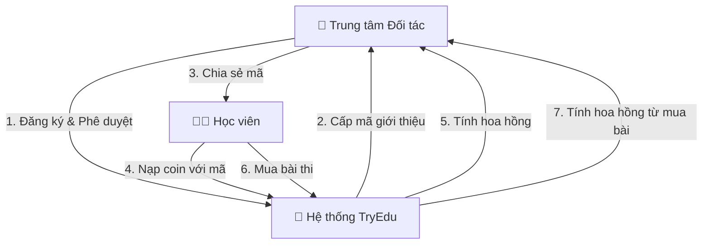
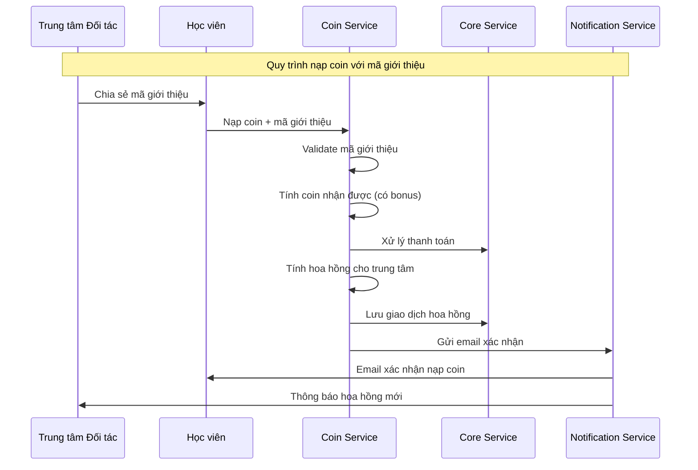

# BÁO CÁO: CÁCH THỨC VẬN HÀNH VÀ CẤP PHÁT PARTNER

## MỤC LỤC

1. [Tổng quan hệ thống Partner](#1-tổng-quan-hệ-thống-partner)
2. [Hoạt động hệ thống](#2-hoạt-động-hệ-thống)
3. [Chính sách Partner](#3-chính-sách-partner)
4. [Cấp phát Partner](#4-cấp-phát-partner)
5. [Quy trình vận hành](#5-quy-trình-vận-hành)
6. [Hệ thống hoa hồng](#6-hệ-thống-hoa-hồng)
7. [Màn hình quản lý trong phần mềm](#7-màn-hình-quản-lý-trong-phần-mềm)
8. [Kết luận](#8-kết-luận)

---

## 1. TỔNG QUAN HỆ THỐNG PARTNER

### 1.1. Khái niệm

**Trung tâm Đối tác (Partner Center)** là các tổ chức giáo dục hoặc cá nhân đăng ký hợp tác với hệ thống để giới thiệu học viên. Họ nhận hoa hồng từ các giao dịch của học viên được giới thiệu thông qua mã giới thiệu.

### 1.2. Mô hình B2B2C

Hệ thống hoạt động theo mô hình **B2B2C (Business-to-Business-to-Consumer)**:
- **Business 1**: Hệ thống giáo dục trực tuyến (TryEdu)
- **Business 2**: Trung tâm Đối tác (Partner Centers)
- **Consumer**: Học viên (Students)

### 1.3. Vai trò của Partner

- Giới thiệu học viên sử dụng dịch vụ
- Hỗ trợ học viên trong quá trình học tập
- Quản lý mã giới thiệu và theo dõi hiệu suất
- Nhận hoa hồng từ giao dịch của học viên

---

## 2. HOẠT ĐỘNG HỆ THỐNG

### 2.1. Kiến trúc hệ thống

Hệ thống được xây dựng dựa trên **Microservices Architecture** với các service chính:

#### **Coin & Partner Service**
- **Technology**: .NET Core 8 + ASP.NET Core Web API
- **Database**: PostgreSQL (coin transactions, partner centers, commissions)
- **Message Queue**: RabbitMQ cho coin events
- **Responsibilities**:
  - Coin transaction management
  - Referral code system
  - Commission calculation
  - Partner center management

#### **Core Service**
- **Database**: PostgreSQL (users, payments, enrollments)
- **Responsibilities**: 
  - User management (auth, profiles)
  - Payment processing
  - Course enrollments
  - Partner center management

#### **Notification Service**
- **Technology**: .NET Core 8 + SignalR
- **Database**: Redis (real-time messaging)
- **Responsibilities**: 
  - Push notifications
  - Real-time updates
  - Email/SMS notifications

### 2.2. Quy trình hoạt động tổng quan



### 2.3. Các thành phần chính

#### **Partner Portal**
- Dashboard hoa hồng với KPIs real-time
- Quản lý mã giới thiệu
- Theo dõi học viên được giới thiệu
- Báo cáo chi tiết và export

#### **Admin Back Office**
- Quản lý đăng ký đối tác
- Phê duyệt/từ chối hồ sơ
- Cấu hình hoa hồng theo tier
- Monitoring hiệu suất đối tác

#### **Database Schema**

**PostgreSQL Tables:**
- `partner_centers`: Thông tin trung tâm đối tác
- `referral_codes`: Mã giới thiệu
- `coin_transactions`: Giao dịch coin
- `commission_transactions`: Giao dịch hoa hồng

---

## 3. CHÍNH SÁCH PARTNER

### 3.1. Hệ thống Tier (Cấp độ đối tác)

Hệ thống phân loại đối tác thành 4 tier dựa trên **doanh thu tích lũy**:

| Tier | Doanh thu tích lũy | Tỷ lệ hoa hồng | Bonus so với Bronze |
|------|-------------------|----------------|---------------------|
| **Bronze** | < 50 triệu VND | 5% | - |
| **Silver** | 50 - 200 triệu VND | 6% | +1% |
| **Gold** | 200 - 500 triệu VND | 7% | +2% |
| **Platinum** | > 500 triệu VND | 8% | +3% |

#### **Đặc điểm hệ thống Tier:**
- **Nâng cấp tự động**: Hệ thống tự động nâng cấp tier khi đạt ngưỡng doanh thu
- **Không giảm tier**: Một khi đã đạt tier cao hơn, đối tác không bị giảm tier
- **Tính từ đầu**: Doanh thu tích lũy được tính từ lúc đăng ký

### 3.2. Chính sách hoa hồng

#### **3.2.1. Hoa hồng từ nạp coin**

- **Tỷ lệ cơ bản**: 5% giá trị nạp
- **Áp dụng tier bonus**: Tỷ lệ tăng theo tier
- **Ví dụ**:
  - Học viên nạp 1,000,000 VND
  - Tier Bronze (5%): Partner nhận 50,000 VND
  - Tier Silver (6%): Partner nhận 60,000 VND
  - Tier Gold (7%): Partner nhận 70,000 VND
  - Tier Platinum (8%): Partner nhận 80,000 VND

#### **3.2.2. Hoa hồng từ mua bài thi**

- **Tỷ lệ cơ bản**: 5% giá trị coin
- **Áp dụng tier bonus**: Tỷ lệ tăng theo tier
- **Quy đổi**: 1 Coin = 100 VND
- **Ví dụ**:
  - Học viên mua bài thi 500 coin (50,000 VND)
  - Tier Bronze (5%): Partner nhận 25 coin = 2,500 VND
  - Tier Silver (6%): Partner nhận 30 coin = 3,000 VND
  - Tier Gold (7%): Partner nhận 35 coin = 3,500 VND
  - Tier Platinum (8%): Partner nhận 40 coin = 4,000 VND

#### **3.2.3. Quy tắc tính hoa hồng**

- **Tính tự động**: Hệ thống tự động tính hoa hồng khi có giao dịch
- **Real-time**: Hoa hồng được cập nhật ngay lập tức
- **Minimum commission**: 10,000 VND/giao dịch
- **Maximum commission**: 1,000,000 VND/giao dịch (áp dụng cho giao dịch lớn)
- **Tính từ mã giới thiệu**: Chỉ tính hoa hồng khi học viên sử dụng mã giới thiệu

### 3.3. Chính sách mã giới thiệu

#### **3.3.1. Quyền tạo mã**

- Mỗi Partner có quyền tạo **không giới hạn** mã giới thiệu
- Mỗi mã có thể cấu hình:
  - Tên mã (unique)
  - Mức giảm giá (% hoặc số coin cố định)
  - Thời hạn sử dụng (30, 60, 90 ngày hoặc không giới hạn)
  - Số lần sử dụng tối đa
  - Điều kiện áp dụng (áp dụng cho bài thi nào)

#### **3.3.2. Mã giới thiệu mặc định**

- Sau khi được phê duyệt, Partner tự động nhận **1 mã giới thiệu mặc định**
- Mã mặc định:
  - Tên: Tự động generate (VD: PARTNER001)
  - Giảm giá: 10%
  - Thời hạn: Không giới hạn
  - Số lần sử dụng: Không giới hạn

### 3.4. Chính sách thanh toán hoa hồng

#### **3.4.1. Lịch thanh toán**

- **Chu kỳ**: Hàng tháng
- **Thời gian**: 10 ngày đầu tháng kế tiếp
- **Phương thức**: Chuyển khoản ngân hàng

#### **3.4.2. Điều kiện thanh toán**

- Tổng hoa hồng tích lũy tối thiểu: 100,000 VND
- Nếu dưới mức tối thiểu: Hoa hồng được giữ lại và cộng dồn tháng sau
- Trạng thái hoa hồng: Pending → Approved → Paid

#### **3.4.3. Hóa đơn và báo cáo**

- Tự động tạo hóa đơn khi thanh toán
- Export báo cáo Excel/PDF theo yêu cầu
- Theo dõi lịch sử thanh toán trong Partner Portal

### 3.5. Chính sách hỗ trợ đối tác

#### **3.5.1. Hỗ trợ kỹ thuật**

- Email hỗ trợ chuyên dụng
- Hotline riêng cho đối tác
- Tài liệu hướng dẫn chi tiết
- Video tutorials

#### **3.5.2. Marketing support**

- Cung cấp marketing materials (banner, logo, nội dung)
- Hướng dẫn quảng bá hiệu quả
- Training sessions định kỳ
- Case studies từ các đối tác thành công

---

## 4. CẤP PHÁT PARTNER

### 4.1. Quy trình đăng ký

#### **Bước 1: Nộp hồ sơ đăng ký**

Trung tâm cần chuẩn bị và nộp:

1. **Thông tin cơ bản:**
   - Tên trung tâm
   - Địa chỉ
   - Số điện thoại

2. **Thông tin liên hệ:**
   - Người đại diện
   - Email
   - Chức vụ

3. **Tài liệu:**
   - Giấy phép kinh doanh (PDF, JPG, tối đa 5MB)
   - Logo trung tâm (PNG, JPG, tối đa 2MB)

4. **Mô tả:**
   - Mô tả về trung tâm
   - Mô tả dịch vụ cung cấp
   - Kinh nghiệm trong lĩnh vực giáo dục

5. **Chọn tier mong muốn:**
   - Bronze (mặc định cho đối tác mới)
   - Có thể đăng ký tier cao hơn nhưng cần chứng minh năng lực

#### **Bước 2: Xác nhận hồ sơ**

- Hệ thống gửi email xác nhận đã nhận hồ sơ trong vòng 24 giờ
- Trạng thái hồ sơ: **"Đã nhận"**

#### **Bước 3: Admin Review**

**Thời gian xử lý:** 3-5 ngày làm việc

**Quy trình review:**

1. **Kiểm tra thông tin:**
   - Xác minh thông tin trung tâm
   - Kiểm tra tính hợp lệ của giấy phép kinh doanh
   - Verify thông tin liên hệ

2. **Đánh giá uy tín:**
   - Tìm hiểu về trung tâm
   - Kiểm tra lịch sử hoạt động
   - Đánh giá tiềm năng hợp tác

3. **Quyết định:**
   - **Phê duyệt**: Tạo tài khoản, gán tier, tạo mã giới thiệu
   - **Từ chối**: Gửi email với lý do cụ thể và hướng dẫn cải thiện
   - **Yêu cầu bổ sung**: Yêu cầu cung cấp thêm thông tin

### 4.2. Quy trình phê duyệt

#### **4.2.1. Trường hợp được phê duyệt**

Khi hồ sơ được phê duyệt, hệ thống tự động:

1. **Tạo tài khoản Partner:**
   - Tạo user account với role "Partner"
   - Gán quyền truy cập Partner Portal
   - Tạo mật khẩu tạm thời

2. **Thiết lập tier:**
   - Mặc định: **Bronze**
   - Nếu đăng ký tier cao hơn: Admin quyết định dựa trên đánh giá

3. **Tạo mã giới thiệu mặc định:**
   - Tự động generate mã unique
   - Cấu hình mặc định: 10% giảm giá, không giới hạn thời gian

4. **Gửi email thông báo:**
   - Thông tin đăng nhập (username, password tạm)
   - Mã giới thiệu mặc định
   - Hướng dẫn sử dụng Partner Portal
   - Link truy cập Partner Portal

#### **4.2.2. Trường hợp bị từ chối**

Khi hồ sơ bị từ chối:

1. **Gửi email thông báo:**
   - Lý do từ chối cụ thể
   - Hướng dẫn cải thiện hồ sơ
   - Thời gian có thể đăng ký lại (sau 30 ngày)

2. **Lý do từ chối phổ biến:**
   - Giấy phép kinh doanh không hợp lệ
   - Thông tin không chính xác
   - Thiếu tài liệu quan trọng
   - Không đáp ứng tiêu chí đối tác

3. **Cơ hội đăng ký lại:**
   - Sau 30 ngày kể từ ngày từ chối
   - Cần cải thiện hồ sơ theo hướng dẫn

#### **4.2.3. Trường hợp yêu cầu bổ sung**

Khi thiếu thông tin:

1. **Gửi email yêu cầu:**
   - Danh sách tài liệu/thông tin cần bổ sung
   - Hạn nộp bổ sung (7 ngày)

2. **Cập nhật hồ sơ:**
   - Partner nộp bổ sung qua Partner Portal
   - Admin tiếp tục review

3. **Quyết định cuối cùng:**
   - Phê duyệt hoặc từ chối sau khi nhận đủ thông tin

### 4.3. Tiêu chí đánh giá đối tác

#### **4.3.1. Tiêu chí bắt buộc**

- ✅ Có giấy phép kinh doanh hợp lệ
- ✅ Thông tin liên hệ đầy đủ và chính xác
- ✅ Có kinh nghiệm trong lĩnh vực giáo dục
- ✅ Có khả năng giới thiệu học viên

#### **4.3.2. Tiêu chí ưu tiên**

- ⭐ Quy mô trung tâm lớn
- ⭐ Có uy tín trong ngành
- ⭐ Có nhiều học viên tiềm năng
- ⭐ Có kế hoạch marketing rõ ràng

### 4.4. Quy trình sau khi được cấp phát

#### **4.4.1. Onboarding (Tuần đầu)**

1. **Đăng nhập lần đầu:**
   - Đổi mật khẩu
   - Hoàn thiện thông tin profile
   - Upload logo và thông tin bổ sung

2. **Hướng dẫn sử dụng:**
   - Xem video hướng dẫn
   - Đọc tài liệu
   - Tham gia training session (nếu cần)

3. **Tạo mã giới thiệu:**
   - Tạo mã đầu tiên
   - Test mã với tài khoản thử nghiệm
   - Hiểu cách mã hoạt động

#### **4.4.2. Bắt đầu hoạt động**

1. **Quảng bá mã giới thiệu:**
   - Chia sẻ mã cho học viên
   - Tích hợp vào website/landing page
   - Quảng cáo trên social media

2. **Theo dõi hiệu suất:**
   - Xem dashboard hoa hồng
   - Theo dõi số học viên được giới thiệu
   - Phân tích conversion rate

3. **Tối ưu hóa:**
   - Tạo nhiều mã cho các chiến dịch khác nhau
   - Điều chỉnh mức giảm giá
   - A/B testing các mã

---

## 5. QUY TRÌNH VẬN HÀNH

### 5.1. Quy trình học viên sử dụng mã giới thiệu



### 5.2. Quy trình tính hoa hồng

#### **5.2.1. Từ nạp coin**

1. Học viên nạp coin với mã giới thiệu
2. Hệ thống validate mã và xác định Partner
3. Tính số coin nhận được (có bonus từ mã)
4. Tính hoa hồng: `Số tiền nạp × Tỷ lệ hoa hồng (theo tier)`
5. Lưu giao dịch hoa hồng vào database
6. Cập nhật dashboard Partner real-time
7. Gửi thông báo cho Partner

**Ví dụ:**
- Học viên nạp: 1,000,000 VND
- Partner tier: Silver (6%)
- Hoa hồng: 1,000,000 × 6% = 60,000 VND

#### **5.2.2. Từ mua bài thi**

1. Học viên mua bài thi với mã giới thiệu
2. Hệ thống validate mã và xác định Partner
3. Trừ coin từ tài khoản học viên
4. Tính hoa hồng: `Giá bài thi (coin) × Tỷ lệ hoa hồng (theo tier)`
5. Lưu giao dịch hoa hồng
6. Cập nhật dashboard Partner
7. Gửi thông báo cho Partner

**Ví dụ:**
- Học viên mua bài thi: 500 coin (50,000 VND)
- Partner tier: Gold (7%)
- Hoa hồng: 500 × 7% = 35 coin = 3,500 VND

### 5.3. Quy trình nâng cấp tier

1. **Theo dõi doanh thu tích lũy:**
   - Hệ thống tự động tính tổng doanh thu từ lúc đăng ký
   - Cập nhật real-time sau mỗi giao dịch

2. **Kiểm tra điều kiện nâng cấp:**
   - So sánh doanh thu tích lũy với ngưỡng tier
   - Nếu đạt ngưỡng: Tự động nâng cấp

3. **Nâng cấp tier:**
   - Cập nhật tier trong database
   - Áp dụng tỷ lệ hoa hồng mới cho các giao dịch tiếp theo
   - Gửi email thông báo nâng cấp cho Partner

4. **Retroactive (nếu có):**
   - Quyết định có tính lại hoa hồng cho các giao dịch trước không
   - Thông thường: Không tính lại, chỉ áp dụng từ thời điểm nâng cấp

**Ví dụ nâng cấp:**
- Partner Bronze: Doanh thu tích lũy = 50,000,000 VND
- Đạt ngưỡng Silver: 50 triệu
- Hệ thống tự động nâng cấp lên Silver
- Tỷ lệ hoa hồng: 5% → 6%

### 5.4. Quy trình thanh toán hoa hồng

1. **Tổng hợp hoa hồng (Cuối tháng):**
   - Hệ thống tổng hợp tất cả hoa hồng trong tháng
   - Phân loại theo trạng thái (Pending, Approved, Cancelled)
   - Tính tổng số tiền cần thanh toán

2. **Xác nhận thanh toán (Đầu tháng kế tiếp):**
   - Accountant review và xác nhận
   - Kiểm tra tính chính xác của số liệu
   - Phê duyệt thanh toán

3. **Thực hiện thanh toán (10 ngày đầu tháng):**
   - Chuyển khoản vào tài khoản ngân hàng của Partner
   - Cập nhật trạng thái: Approved → Paid
   - Tạo hóa đơn và gửi cho Partner

4. **Hoàn tất:**
   - Gửi email xác nhận thanh toán
   - Partner có thể tải hóa đơn từ Portal
   - Cập nhật lịch sử thanh toán

---

## 6. HỆ THỐNG HOA HỒNG

### 6.1. Cấu trúc tính hoa hồng

#### **6.1.1. Từ nạp coin**

```
Hoa hồng = Số tiền nạp × Tỷ lệ hoa hồng (theo tier)

Tỷ lệ hoa hồng:
- Bronze: 5%
- Silver: 6%
- Gold: 7%
- Platinum: 8%
```

#### **6.1.2. Từ mua bài thi**

```
Hoa hồng (coin) = Giá bài thi (coin) × Tỷ lệ hoa hồng (theo tier)
Hoa hồng (VND) = Hoa hồng (coin) × 100 VND

Tỷ lệ hoa hồng:
- Bronze: 5%
- Silver: 6%
- Gold: 7%
- Platinum: 8%
```

### 6.2. Ví dụ tính hoa hồng

#### **Ví dụ 1: Trung tâm có 200 học viên/tháng**

**Giả định:**
- 200 học viên/tháng sử dụng mã giới thiệu
- Mỗi học viên nạp trung bình: 500,000 VND/tháng
- Mỗi học viên mua trung bình: 3 bài thi/tháng (giá TB: 200 coin = 20,000 VND)

**Tính toán hoa hồng:**

**Hoa hồng từ nạp coin:**
```
200 học viên × 500,000 VND × 5% (Bronze) = 5,000,000 VND/tháng
200 học viên × 500,000 VND × 8% (Platinum) = 8,000,000 VND/tháng
```

**Hoa hồng từ mua bài thi:**
```
200 × 3 bài × 200 coin × 100 VND × 5% (Bronze) = 6,000,000 VND/tháng
200 × 3 bài × 200 coin × 100 VND × 8% (Platinum) = 9,600,000 VND/tháng
```

**Tổng hoa hồng/tháng:**
```
Tier Bronze: 5,000,000 + 6,000,000 = 11,000,000 VND/tháng
Tier Platinum: 8,000,000 + 9,600,000 = 17,600,000 VND/tháng
```

**Tổng hoa hồng/năm:**
```
Tier Bronze: 132,000,000 VND/năm
Tier Platinum: 211,200,000 VND/năm
```

### 6.3. Dashboard hoa hồng

Partner có thể xem dashboard với các KPIs:

1. **Tổng hoa hồng đã nhận** (tất cả thời gian)
2. **Hoa hồng tháng này**
3. **Số học viên được giới thiệu**
4. **Số học viên đang hoạt động**
5. **Biểu đồ doanh thu theo thời gian**
6. **Top mã giới thiệu hiệu quả nhất**
7. **Conversion rate**

### 6.4. Báo cáo hoa hồng

#### **6.4.1. Báo cáo chi tiết**

- Báo cáo theo ngày/tháng/năm
- Filter theo loại giao dịch (nạp coin, mua bài thi)
- Danh sách học viên được giới thiệu
- Lịch sử giao dịch chi tiết
- So sánh hiệu suất theo các kỳ

#### **6.4.2. Export báo cáo**

- Export Excel
- Export PDF
- Schedule báo cáo tự động

---

## 7. MÀN HÌNH QUẢN LÝ TRONG PHẦN MỀM

### 7.1. Partner Portal - Màn hình cho Trung tâm Đối tác

Partner Portal được xây dựng trên **Blazor Server** với giao diện responsive, cho phép đối tác quản lý toàn bộ hoạt động từ một nền tảng duy nhất.

#### **7.1.1. Dashboard Tổng quan**

**Màn hình chính khi đăng nhập vào Partner Portal:**

**KPIs hiển thị:**
- 📊 **Tổng hoa hồng đã nhận**: Số tiền tổng cộng từ lúc đăng ký
- 💰 **Hoa hồng tháng này**: Số tiền trong tháng hiện tại
- 👥 **Số học viên được giới thiệu**: Tổng số học viên đã sử dụng mã
- ✅ **Số học viên đang hoạt động**: Học viên có giao dịch trong 30 ngày gần nhất
- 📈 **Tier hiện tại**: Bronze/Silver/Gold/Platinum với tiến trình đến tier tiếp theo

**Biểu đồ và thống kê:**
- 📉 Biểu đồ doanh thu theo thời gian (ngày/tuần/tháng/năm)
- 📊 Biểu đồ số học viên theo thời gian
- 🎯 Top 5 mã giới thiệu hiệu quả nhất
- 📋 Thông báo và cập nhật mới

**Tính năng:**
- Real-time updates (cập nhật tự động mỗi vài giây)
- Filter theo khoảng thời gian
- Export dashboard thành PDF
- Responsive design (mobile-friendly)

#### **7.1.2. Quản lý Mã Giới thiệu**

**Màn hình danh sách mã giới thiệu:**

**Hiển thị:**
- Bảng danh sách tất cả mã đã tạo
- Cột thông tin: Tên mã, Mức giảm giá, Số lần sử dụng, Trạng thái, Thời hạn
- Filter: Theo trạng thái (Active/Inactive/Expired)
- Search: Tìm kiếm theo tên mã

**Thao tác:**
- ➕ **Tạo mã mới**: Form tạo mã với các tùy chọn:
  - Tên mã (unique)
  - Mức giảm giá (% hoặc coin cố định)
  - Thời hạn sử dụng
  - Số lần sử dụng tối đa
  - Điều kiện áp dụng
- ✏️ **Chỉnh sửa mã**: Edit mã chưa được sử dụng
- ⏸️ **Tạm dừng/Kích hoạt**: Bật/tắt mã
- 🗑️ **Xóa mã**: Xóa mã không cần thiết
- 📋 **Copy mã**: Copy mã để chia sẻ
- 📊 **Xem thống kê**: Click vào mã để xem chi tiết

**Màn hình chi tiết mã giới thiệu:**

**Thông tin hiển thị:**
- Thông tin mã: Tên, giảm giá, thời hạn, số lần sử dụng
- Thống kê sử dụng:
  - Tổng số lần sử dụng
  - Số coin đã giảm cho học viên
  - Số học viên đã sử dụng
  - Conversion rate
- Biểu đồ sử dụng theo thời gian
- Danh sách học viên đã sử dụng mã

#### **7.1.3. Quản lý Học viên**

**Màn hình danh sách học viên:**

**Hiển thị:**
- Bảng danh sách học viên được giới thiệu
- Cột thông tin: Tên, Email, Số điện thoại, Ngày đăng ký, Trạng thái, Tổng chi tiêu
- Filter: Theo trạng thái (Active/Inactive/Premium), Theo mã giới thiệu
- Search: Tìm kiếm theo tên, email, số điện thoại
- Sort: Sắp xếp theo ngày đăng ký, tổng chi tiêu

**Màn hình chi tiết học viên:**

**Thông tin hiển thị:**
- Thông tin cá nhân: Tên, email, số điện thoại
- Lịch sử hoạt động:
  - Số coin đã nạp
  - Số bài thi đã mua
  - Tiến độ học tập
  - Điểm số các bài thi
- Lịch sử giao dịch: Tất cả giao dịch với mã giới thiệu
- Thời gian hoạt động cuối

**Thao tác:**
- 📧 **Gửi thông báo**: Gửi email/thông báo cho học viên
- 💬 **Liên hệ**: Hỗ trợ học viên trực tiếp

#### **7.1.4. Dashboard Hoa hồng**

**Màn hình báo cáo hoa hồng:**

**Hiển thị:**
- Bảng danh sách giao dịch hoa hồng
- Cột thông tin: Ngày, Loại giao dịch, Số tiền, Hoa hồng, Trạng thái, Học viên
- Filter: Theo loại (Nạp coin/Mua bài thi), Theo trạng thái, Theo khoảng thời gian
- Tổng hợp: Tổng hoa hồng theo từng loại

**Báo cáo chi tiết:**
- 📅 Báo cáo theo ngày/tháng/năm
- 📊 So sánh hiệu suất theo các kỳ
- 📈 Biểu đồ xu hướng hoa hồng
- 📋 Top học viên mang lại hoa hồng cao nhất

**Thao tác:**
- 📥 **Export Excel**: Xuất báo cáo ra Excel
- 📄 **Export PDF**: Xuất báo cáo ra PDF
- 📧 **Gửi email**: Gửi báo cáo qua email
- ⏰ **Schedule**: Lên lịch gửi báo cáo tự động

#### **7.1.5. Lịch Thanh toán Hoa hồng**

**Màn hình quản lý thanh toán:**

**Hiển thị:**
- Bảng lịch sử thanh toán hoa hồng
- Cột thông tin: Tháng, Tổng hoa hồng, Trạng thái, Ngày thanh toán, Hóa đơn
- Filter: Theo trạng thái (Pending/Approved/Paid), Theo khoảng thời gian

**Thông tin chi tiết:**
- Chi tiết từng giao dịch trong tháng
- Phương thức thanh toán
- Thông tin tài khoản ngân hàng
- Download hóa đơn (PDF)

#### **7.1.6. Cài đặt Tài khoản**

**Màn hình quản lý tài khoản:**

**Hiển thị và chỉnh sửa:**
- Thông tin trung tâm: Tên, địa chỉ, số điện thoại
- Thông tin liên hệ: Người đại diện, email, chức vụ
- Logo trung tâm: Upload/Thay đổi logo
- Thông tin tài khoản ngân hàng: Để nhận hoa hồng
- Cài đặt thông báo: Email/SMS notifications

### 7.2. Admin Back Office - Màn hình cho Quản trị viên

Admin Back Office được xây dựng trên **Blazor Server** với đầy đủ công cụ quản lý hệ thống Partner.

#### **7.2.1. Quản lý Đăng ký Đối tác**

**Màn hình danh sách hồ sơ đăng ký:**

**Hiển thị:**
- Bảng danh sách tất cả hồ sơ đăng ký
- Cột thông tin: Tên trung tâm, Người đại diện, Email, Ngày nộp, Trạng thái
- Filter: Theo trạng thái (Chờ xử lý/Đã phê duyệt/Đã từ chối/Yêu cầu bổ sung)
- Search: Tìm kiếm theo tên trung tâm, email

**Thao tác:**
- 👁️ **Xem chi tiết**: Xem đầy đủ hồ sơ và tài liệu
- ✅ **Phê duyệt**: Phê duyệt hồ sơ và tạo tài khoản
- ❌ **Từ chối**: Từ chối với lý do cụ thể
- 📝 **Yêu cầu bổ sung**: Yêu cầu thêm thông tin

**Màn hình review hồ sơ:**

**Hiển thị:**
- Form xem đầy đủ thông tin hồ sơ
- Upload files: Xem giấy phép kinh doanh, logo
- Comments: Ghi chú trong quá trình review
- Action buttons: Phê duyệt/Từ chối/Yêu cầu bổ sung

#### **7.2.2. Quản lý Đối tác**

**Màn hình danh sách đối tác:**

**Hiển thị:**
- Bảng danh sách tất cả đối tác đã được phê duyệt
- Cột thông tin: Tên trung tâm, Tier, Số học viên, Tổng hoa hồng, Trạng thái
- Filter: Theo tier, Theo trạng thái (Active/Inactive/Suspended)
- Search: Tìm kiếm theo tên, email

**Màn hình chi tiết đối tác:**

**Hiển thị:**
- Thông tin trung tâm: Đầy đủ thông tin liên hệ
- Thống kê hiệu suất:
  - Tổng số học viên được giới thiệu
  - Tổng doanh thu tích lũy
  - Tổng hoa hồng đã nhận
  - Conversion rate
- Biểu đồ hiệu suất theo thời gian
- Danh sách mã giới thiệu của đối tác
- Lịch sử giao dịch hoa hồng

**Thao tác:**
- ✏️ **Chỉnh sửa thông tin**: Cập nhật thông tin đối tác
- 💰 **Cấu hình hoa hồng**: Thay đổi tỷ lệ hoa hồng (nếu cần)
- 🔒 **Khóa/Mở khóa**: Tạm dừng hoặc kích hoạt đối tác
- 📧 **Gửi email**: Gửi thông báo cho đối tác

#### **7.2.3. Cấu hình Hoa hồng**

**Màn hình cấu hình hệ thống hoa hồng:**

**Hiển thị:**
- Bảng cấu hình tier:
  - Bronze: 5% (doanh thu < 50 triệu)
  - Silver: 6% (doanh thu 50-200 triệu)
  - Gold: 7% (doanh thu 200-500 triệu)
  - Platinum: 8% (doanh thu > 500 triệu)
- Cấu hình tỷ lệ hoa hồng cơ bản
- Cấu hình minimum/maximum commission
- Cấu hình điều kiện nâng cấp tier

**Thao tác:**
- ✏️ **Chỉnh sửa tỷ lệ**: Thay đổi tỷ lệ hoa hồng theo tier
- ➕ **Thêm tier mới**: Tạo tier đặc biệt (nếu cần)
- 💾 **Lưu thay đổi**: Áp dụng cấu hình mới

**Màn hình cấu hình hoa hồng cho từng đối tác:**

**Hiển thị:**
- Danh sách đối tác với tỷ lệ hoa hồng hiện tại
- Form chỉnh sửa tỷ lệ đặc biệt cho từng đối tác
- Lịch sử thay đổi tỷ lệ hoa hồng

#### **7.2.4. Dashboard Tổng quan Đối tác**

**Màn hình dashboard admin:**

**KPIs hiển thị:**
- 📊 **Tổng số đối tác**: Tổng số đối tác trong hệ thống
- 👥 **Tổng số học viên**: Tổng số học viên được giới thiệu
- 💰 **Tổng doanh thu**: Tổng doanh thu từ đối tác
- 💵 **Tổng hoa hồng đã trả**: Tổng số tiền hoa hồng đã thanh toán

**Biểu đồ và thống kê:**
- 📈 Biểu đồ số đối tác mới theo thời gian
- 📊 Biểu đồ doanh thu từ đối tác theo thời gian
- 🎯 Top 10 đối tác có hiệu suất cao nhất
- 📋 Phân bổ đối tác theo tier

**Tính năng:**
- Real-time updates
- Filter theo khoảng thời gian
- Export báo cáo tổng hợp

#### **7.2.5. Monitoring và Báo cáo**

**Màn hình monitoring hiệu suất:**

**Hiển thị:**
- Bảng monitoring tất cả đối tác real-time
- Phát hiện bất thường:
  - Giao dịch bất thường
  - Mã giới thiệu có vấn đề
  - Đối tác có hoạt động gian lận
- Alert system: Thông báo khi có vấn đề

**Màn hình báo cáo tổng hợp:**

**Hiển thị:**
- Báo cáo doanh thu theo đối tác
- Báo cáo hoa hồng đã thanh toán
- Báo cáo hiệu suất theo tier
- So sánh hiệu suất các đối tác

**Thao tác:**
- 📥 **Export Excel**: Xuất báo cáo ra Excel
- 📄 **Export PDF**: Xuất báo cáo ra PDF
- 📧 **Gửi email**: Gửi báo cáo định kỳ
- ⏰ **Schedule**: Lên lịch tạo báo cáo tự động

#### **7.2.6. Xử lý Khiếu nại**

**Màn hình quản lý khiếu nại:**

**Hiển thị:**
- Bảng danh sách khiếu nại từ đối tác
- Cột thông tin: Đối tác, Loại khiếu nại, Ngày, Trạng thái
- Filter: Theo trạng thái, Theo loại
- Search: Tìm kiếm theo đối tác

**Màn hình chi tiết khiếu nại:**

**Hiển thị:**
- Thông tin khiếu nại: Mô tả vấn đề, bằng chứng
- Lịch sử xử lý: Comments, giải pháp
- Action: Giải quyết/Cập nhật trạng thái

### 7.3. Tính năng chung của các màn hình

#### **7.3.1. Responsive Design**
- ✅ Tương thích mọi thiết bị (Desktop, Tablet, Mobile)
- ✅ UI/UX tối ưu cho từng kích thước màn hình
- ✅ Touch-friendly cho mobile devices

#### **7.3.2. Real-time Updates**
- ✅ Cập nhật dữ liệu tự động (SignalR)
- ✅ Thông báo real-time khi có giao dịch mới
- ✅ Live dashboard với dữ liệu mới nhất

#### **7.3.3. Security Features**
- ✅ Authentication và Authorization
- ✅ Session management
- ✅ Audit logging (ghi lại mọi thao tác)
- ✅ Data encryption

#### **7.3.4. Performance Optimization**
- ✅ Lazy loading cho danh sách lớn
- ✅ Pagination và virtual scrolling
- ✅ Caching để tăng tốc độ
- ✅ Load time < 2 giây

#### **7.3.5. Export và Báo cáo**
- ✅ Export Excel với format chuẩn
- ✅ Export PDF với layout đẹp
- ✅ Schedule báo cáo tự động
- ✅ Email báo cáo định kỳ

---

## 8. KẾT LUẬN

### 8.1. Tóm tắt

Hệ thống cấp phát và vận hành Partner được thiết kế để:

1. **Đơn giản hóa quy trình đăng ký**: Form rõ ràng, workflow tự động
2. **Tự động hóa hoàn toàn**: Tính hoa hồng, nâng cấp tier, thanh toán
3. **Minh bạch**: Dashboard real-time, báo cáo chi tiết
4. **Công bằng**: Hệ thống tier dựa trên doanh thu tích lũy
5. **Hỗ trợ tốt**: Tài liệu, training, marketing support

### 8.2. Lợi ích cho Partner

- **Nguồn thu nhập thụ động**: Hoa hồng từ học viên được giới thiệu
- **Công cụ quản lý mạnh mẽ**: Dashboard và báo cáo chi tiết
- **Tự do tạo mã**: Không giới hạn số lượng mã giới thiệu
- **Nâng cấp tự động**: Tier tăng dần theo hiệu suất
- **Hỗ trợ chuyên dụng**: Đội ngũ hỗ trợ riêng cho đối tác

### 8.3. Lợi ích cho Hệ thống

- **Mở rộng thị trường**: Tiếp cận học viên qua mạng lưới đối tác
- **Tăng doanh thu**: Nhiều học viên sử dụng dịch vụ
- **Giảm chi phí marketing**: Đối tác tự quảng bá
- **Xây dựng ecosystem**: Tạo mạng lưới đối tác bền vững

### 8.4. Các điểm cần lưu ý

1. **Tiêu chí phê duyệt nghiêm ngặt**: Đảm bảo chất lượng đối tác
2. **Monitoring hiệu suất**: Phát hiện và xử lý gian lận
3. **Hỗ trợ kịp thời**: Đội ngũ hỗ trợ sẵn sàng giải đáp
4. **Cập nhật chính sách**: Điều chỉnh theo tình hình thực tế

### 8.5. Hướng phát triển

1. **Mở rộng chương trình đối tác**: Nhiều loại hình đối tác hơn
2. **Cải thiện công cụ**: Dashboard và báo cáo ngày càng tốt hơn
3. **Tăng tỷ lệ hoa hồng**: Ưu đãi cho đối tác có hiệu suất cao
4. **Chương trình khuyến khích**: Thưởng cho đối tác xuất sắc

---

**Tài liệu này được tạo dựa trên:**
- Hệ thống Giáo dục Trực tuyến V2.0 (B2B2C Model)
- Database Schema PostgreSQL
- EPIC 8: Hệ thống Trung tâm Đối tác
- EPIC 9: Hệ thống Coin và Mã Giới thiệu

**Phiên bản:** 1.0
**Ngày cập nhật:** 2025

