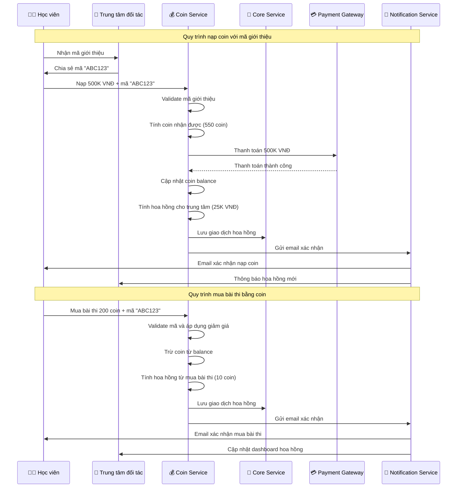
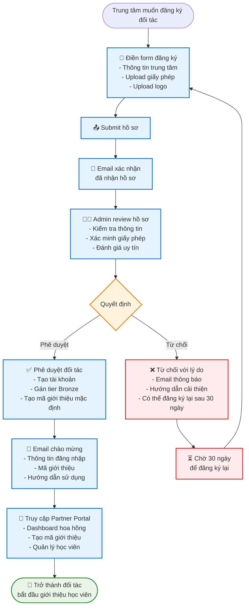
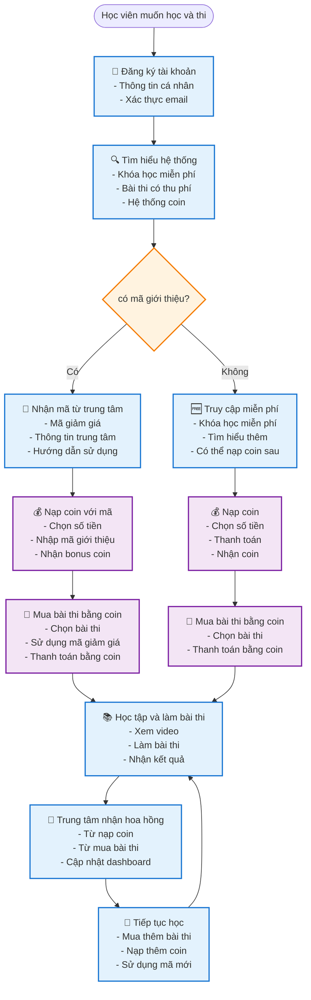
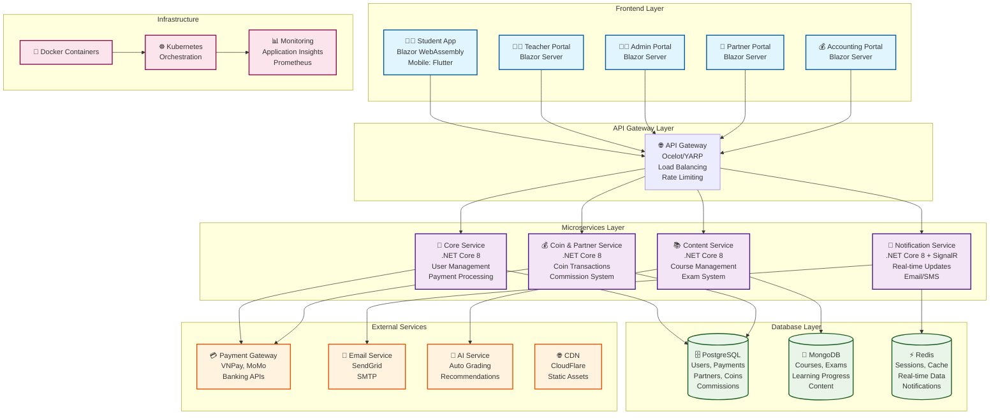

# HỆ THỐNG GIÁO DỤC TRỰC TUYẾN V2.0 - B2B2C MODEL
## Tích hợp Trung Tâm Đối Tác & Hệ Thống Coin

## MỤC LỤC

1. [Sơ đồ cây chức năng tổng quan](#sơ-đồ-cây-chức-năng-tổng-quan)
2. [Tổng quan hệ thống](#tổng-quan-hệ-thống)
3. [Kiến trúc và vai trò người dùng](#kiến-trúc-và-vai-trò-người-dùng)
4. [EPIC 1: Quản lý người dùng và xác thực](#epic-1-quản-lý-người-dùng-và-xác-thực)
5. [EPIC 2: Quản lý khóa học và bài thi](#epic-2-quản-lý-khóa-học-và-bài-thi)
6. [EPIC 3: Hệ thống học tập trực tuyến](#epic-3-hệ-thống-học-tập-trực-tuyến)
7. [EPIC 4: Hệ thống đánh giá và chấm điểm](#epic-4-hệ-thống-đánh-giá-và-chấm-điểm)
8. [EPIC 5: Quản lý tài chính và thanh toán](#epic-5-quản-lý-tài-chính-và-thanh-toán)
9. [EPIC 6: Hệ thống hỗ trợ và tương tác](#epic-6-hệ-thống-hỗ-trợ-và-tương-tác)
10. [EPIC 7: Quản trị, báo cáo và bảo mật](#epic-7-quản-trị-báo-cáo-và-bảo-mật)
11. **[EPIC 8: Hệ thống trung tâm đối tác (MỚI)](#epic-8-hệ-thống-trung-tâm-đối-tác-mới)**
12. **[EPIC 9: Hệ thống coin và mã giới thiệu (MỚI)](#epic-9-hệ-thống-coin-và-mã-giới-thiệu-mới)**
13. [User Journey Maps](#user-journey-maps)
14. [Technical Specifications](#technical-specifications)
15. [Project Timeline](#project-timeline)
16. [Kế hoạch sản xuất với Team Scrum](#kế-hoạch-sản-xuất-với-team-scrum)

---

## SƠ ĐỒ QUY TRÌNH TỔNG QUAN V2.0

### 🔄 **Sơ đồ quy trình hệ thống B2B2C**

```mermaid
graph TB
    %% Các vai trò người dùng
    Student[👨‍🎓 HỌC VIÊN<br/>Student App/Web]
    Teacher[👨‍🏫 GIÁO VIÊN<br/>Teacher Portal]
    Admin[👨‍💼 QUẢN TRỊ VIÊN<br/>Admin Back Office]
    Accountant[💰 NHÂN VIÊN KẾ TOÁN<br/>Accounting Portal]
    Partner[🏢 TRUNG TÂM ĐỐI TÁC<br/>Partner Portal]
    
    %% Hệ thống core
    CoreService[🔧 Core Service<br/>User Management<br/>Payment Processing]
    ContentService[📚 Content Service<br/>Course Management<br/>Exam System]
    CoinService[💰 Coin & Partner Service<br/>Coin Transactions<br/>Commission System]
    NotificationService[📢 Notification Service<br/>Email/SMS<br/>Real-time Updates]
    
    %% Database
    PostgreSQL[(🗄️ PostgreSQL<br/>Users, Payments<br/>Partners, Coins)]
    MongoDB[(📄 MongoDB<br/>Courses, Exams<br/>Learning Progress)]
    Redis[(⚡ Redis<br/>Sessions, Cache<br/>Real-time Data)]
    
    %% External Services
    PaymentGateway[💳 Payment Gateway<br/>VNPay, MoMo<br/>Banking APIs]
    EmailService[📧 Email Service<br/>SendGrid<br/>Notifications]
    AIService[🤖 AI Service<br/>Auto Grading<br/>Recommendations]
    
    %% Quy trình học viên
    Student -->|Đăng ký/Đăng nhập| CoreService
    Student -->|Truy cập khóa học miễn phí| ContentService
    Student -->|Nạp coin| CoinService
    Student -->|Sử dụng mã giới thiệu| CoinService
    Student -->|Mua bài thi bằng coin| ContentService
    Student -->|Học tập và làm bài thi| ContentService
    
    %% Quy trình giáo viên
    Teacher -->|Đăng ký với CV| CoreService
    Teacher -->|Chấm bài thi| ContentService
    Teacher -->|Tạo nội dung| ContentService
    Teacher -->|Nhận commission| CoinService
    
    %% Quy trình admin
    Admin -->|Quản lý người dùng| CoreService
    Admin -->|Tạo khóa học/bài thi| ContentService
    Admin -->|Quản lý đối tác| CoinService
    Admin -->|Dashboard tổng quan| CoreService
    
    %% Quy trình kế toán
    Accountant -->|Quản lý thanh toán| CoreService
    Accountant -->|Báo cáo tài chính| CoinService
    Accountant -->|Quản lý hoa hồng| CoinService
    
    %% Quy trình trung tâm đối tác
    Partner -->|Đăng ký đối tác| CoreService
    Partner -->|Tạo mã giới thiệu| CoinService
    Partner -->|Theo dõi học viên| CoinService
    Partner -->|Xem dashboard hoa hồng| CoinService
    
    %% Kết nối services với database
    CoreService --> PostgreSQL
    ContentService --> MongoDB
    CoinService --> PostgreSQL
    NotificationService --> Redis
    
    %% Kết nối với external services
    CoreService --> PaymentGateway
    CoinService --> PaymentGateway
    NotificationService --> EmailService
    ContentService --> AIService
    
    %% Styling
    classDef userClass fill:#e1f5fe,stroke:#01579b,stroke-width:2px
    classDef serviceClass fill:#f3e5f5,stroke:#4a148c,stroke-width:2px
    classDef dbClass fill:#e8f5e8,stroke:#1b5e20,stroke-width:2px
    classDef externalClass fill:#fff3e0,stroke:#e65100,stroke-width:2px
    
    class Student,Teacher,Admin,Accountant,Partner userClass
    class CoreService,ContentService,CoinService,NotificationService serviceClass
    class PostgreSQL,MongoDB,Redis dbClass
    class PaymentGateway,EmailService,AIService externalClass
```



### 🔄 **Sơ đồ quy trình Coin và Hoa hồng**



### 🔄 **Sơ đồ quy trình đăng ký đối tác**



### 🔄 **Sơ đồ quy trình học viên với mã giới thiệu**



### 🔄 **Sơ đồ cây quy trình hoạt động hệ thống V2.0**

```mermaid
graph TD
    %% Root node
    System[🏫 HỆ THỐNG GIÁO DỤC TRỰC TUYẾN V2.0<br/>B2B2C MODEL]
    
    %% Level 1: User Types
    System --> Students[👨‍🎓 HỌC VIÊN<br/>Student App/Web]
    System --> Teachers[👨‍🏫 GIÁO VIÊN<br/>Teacher Portal]
    System --> Admins[👨‍💼 QUẢN TRỊ VIÊN<br/>Admin Back Office]
    System --> Accountants[💰 NHÂN VIÊN KẾ TOÁN<br/>Accounting Portal]
    System --> Partners[🏢 TRUNG TÂM ĐỐI TÁC<br/>Partner Portal]
    
    %% Level 2: Student Activities
    Students --> StudentAuth[🔐 Xác thực<br/>- Đăng ký tài khoản<br/>- Đăng nhập<br/>- Xác thực email]
    Students --> StudentFree[🆓 Truy cập miễn phí<br/>- Khóa học miễn phí<br/>- Tìm hiểu hệ thống<br/>- Xem preview]
    Students --> StudentCoin[💰 Hệ thống Coin<br/>- Nạp coin vào tài khoản<br/>- Sử dụng mã giới thiệu<br/>- Quản lý ví coin]
    Students --> StudentPurchase[🛒 Mua hàng<br/>- Mua khóa học có thu phí<br/>- Mua bài thi thử bằng coin<br/>- Sử dụng voucher]
    Students --> StudentLearn[📚 Học tập<br/>- Xem video bài học<br/>- Làm quiz<br/>- Tạo ghi chú<br/>- Học offline]
    Students --> StudentExam[🧪 Làm bài thi<br/>- Chọn bài thi<br/>- Làm bài với timer<br/>- Nhận kết quả AI<br/>- Xem feedback]
    Students --> StudentProgress[📈 Theo dõi tiến độ<br/>- Dashboard học tập<br/>- Lịch sử giao dịch<br/>- Achievements<br/>- Báo cáo chi tiết]
    Students --> StudentSupport[🆘 Hỗ trợ<br/>- Tạo ticket<br/>- Chat trực tiếp<br/>- FAQ<br/>- Video hướng dẫn]
    Students --> StudentCommunity[👥 Cộng đồng<br/>- Forum discussion<br/>- Study groups<br/>- Peer review<br/>- Social features]
    
    %% Level 2: Teacher Activities
    Teachers --> TeacherAuth[🔐 Xác thực<br/>- Đăng ký với CV<br/>- Upload chứng chỉ<br/>- Chờ admin phê duyệt]
    Teachers --> TeacherContent[📚 Tạo nội dung<br/>- Tạo khóa học<br/>- Quản lý ngân hàng đề thi<br/>- Tạo cấu trúc đề thi tự động<br/>- Quản lý ngân hàng bài học]
    Teachers --> TeacherGrading[📝 Chấm bài thi<br/>- Chấm Writing<br/>- Chấm Speaking<br/>- Sử dụng AI hỗ trợ<br/>- Viết feedback]
    Teachers --> TeacherEarning[💰 Thu nhập<br/>- Nhận commission<br/>- Xem báo cáo thu nhập<br/>- Quản lý tài khoản]
    
    %% Level 2: Admin Activities
    Admins --> AdminUser[👥 Quản lý người dùng<br/>- Phê duyệt giáo viên<br/>- Phê duyệt trung tâm đối tác<br/>- Khóa/mở khóa tài khoản<br/>- Quản lý roles]
    Admins --> AdminContent[📚 Quản lý nội dung<br/>- Tạo khóa học miễn phí<br/>- Tạo bài thi có thu phí<br/>- Quản lý ngân hàng đề thi<br/>- Quản lý ngân hàng bài học]
    Admins --> AdminPartner[🏢 Quản lý đối tác<br/>- Phê duyệt đăng ký đối tác<br/>- Cấu hình hoa hồng<br/>- Monitor hiệu suất<br/>- Xử lý khiếu nại]
    Admins --> AdminCoin[💰 Quản lý coin<br/>- Thiết lập tỷ giá<br/>- Quản lý giao dịch<br/>- Xử lý refund<br/>- Báo cáo tài chính]
    Admins --> AdminSystem[⚙️ Quản lý hệ thống<br/>- Dashboard tổng quan<br/>- Bảo mật hệ thống<br/>- Monitoring performance<br/>- Backup & recovery]
    Admins --> AdminReports[📊 Báo cáo<br/>- Báo cáo doanh thu<br/>- Báo cáo người dùng<br/>- Báo cáo đối tác<br/>- Analytics AI]
    
    %% Level 2: Accountant Activities
    Accountants --> AccPayment[💳 Quản lý thanh toán<br/>- Xem giao dịch coin<br/>- Xử lý thanh toán thất bại<br/>- Reconcile ngân hàng<br/>- Refund coin]
    Accountants --> AccCommission[💰 Quản lý hoa hồng<br/>- Tính hoa hồng đối tác<br/>- Thanh toán hoa hồng<br/>- Báo cáo commission<br/>- Quản lý thuế]
    Accountants --> AccReports[📊 Báo cáo tài chính<br/>- Báo cáo doanh thu<br/>- Báo cáo chi phí<br/>- Báo cáo lợi nhuận<br/>- Export Excel/PDF]
    
    %% Level 2: Partner Activities
    Partners --> PartnerAuth[🔐 Xác thực<br/>- Đăng ký đối tác<br/>- Upload giấy phép<br/>- Chờ admin phê duyệt<br/>- Nhận mã giới thiệu]
    Partners --> PartnerCode[🎫 Quản lý mã giới thiệu<br/>- Tạo mã mới<br/>- Thiết lập mức giảm giá<br/>- Quản lý thời hạn<br/>- Copy và chia sẻ mã]
    Partners --> PartnerStudent[👥 Quản lý học viên<br/>- Xem danh sách học viên<br/>- Theo dõi hoạt động<br/>- Gửi thông báo<br/>- Hỗ trợ học viên]
    Partners --> PartnerCommission[💰 Dashboard hoa hồng<br/>- Xem tổng hoa hồng<br/>- Báo cáo chi tiết<br/>- Lịch sử giao dịch<br/>- Export báo cáo]
    Partners --> PartnerSupport[🆘 Hỗ trợ đối tác<br/>- Liên hệ hỗ trợ<br/>- Tài liệu hướng dẫn<br/>- Training sessions<br/>- Marketing materials]
    
    %% Level 3: Detailed Processes
    StudentCoin --> CoinPurchase[💳 Nạp coin<br/>- Chọn số tiền<br/>- Chọn phương thức thanh toán<br/>- Nhập mã giới thiệu<br/>- Xác nhận giao dịch]
    StudentCoin --> CoinUsage[🔄 Sử dụng coin<br/>- Mua bài thi<br/>- Mua khóa học<br/>- Xem lịch sử<br/>- Quản lý balance]
    
    StudentPurchase --> PurchaseFlow[🛒 Quy trình mua hàng<br/>- Chọn sản phẩm<br/>- Áp dụng mã giảm giá<br/>- Thanh toán bằng coin<br/>- Nhận email xác nhận]
    
    TeacherGrading --> GradingProcess[📝 Quy trình chấm bài<br/>- Nhận bài thi cần chấm<br/>- Sử dụng AI gợi ý<br/>- Chấm điểm thủ công<br/>- Viết feedback chi tiết<br/>- Submit kết quả]
    
    AdminPartner --> PartnerApproval[✅ Phê duyệt đối tác<br/>- Review hồ sơ<br/>- Xác minh giấy phép<br/>- Đánh giá uy tín<br/>- Tạo tài khoản<br/>- Gán tier]
    
    PartnerCode --> CodeCreation[🎫 Tạo mã giới thiệu<br/>- Nhập tên mã<br/>- Thiết lập giảm giá<br/>- Thiết lập thời hạn<br/>- Thiết lập số lần sử dụng<br/>- Preview và tạo]
    
    %% Level 4: System Integration
    CoinPurchase --> PaymentGateway[💳 Payment Gateway<br/>VNPay, MoMo, Banking]
    CoinPurchase --> CoinService[💰 Coin Service<br/>Validate, Calculate, Store]
    CoinPurchase --> CommissionCalc[💸 Commission Calculation<br/>Tính hoa hồng tự động]
    
    PurchaseFlow --> ContentService[📚 Content Service<br/>Course, Exam Management]
    PurchaseFlow --> NotificationService[📢 Notification Service<br/>Email, SMS, Real-time]
    
    GradingProcess --> AIService[🤖 AI Service<br/>Auto Grading, Suggestions]
    GradingProcess --> ContentService
    
    PartnerApproval --> CoreService[🔧 Core Service<br/>User Management]
    PartnerApproval --> CoinService
    
    CodeCreation --> CoinService
    CodeCreation --> Database[🗄️ Database<br/>PostgreSQL, MongoDB, Redis]
    
    %% Styling
    classDef rootClass fill:#ff6b6b,stroke:#d63031,stroke-width:3px,color:#fff
    classDef userClass fill:#74b9ff,stroke:#0984e3,stroke-width:2px,color:#fff
    classDef activityClass fill:#a29bfe,stroke:#6c5ce7,stroke-width:2px,color:#fff
    classDef processClass fill:#fd79a8,stroke:#e84393,stroke-width:2px,color:#fff
    classDef serviceClass fill:#00b894,stroke:#00a085,stroke-width:2px,color:#fff
    classDef systemClass fill:#fdcb6e,stroke:#e17055,stroke-width:2px,color:#fff
    
    class System rootClass
    class Students,Teachers,Admins,Accountants,Partners userClass
    class StudentAuth,StudentFree,StudentCoin,StudentPurchase,StudentLearn,StudentExam,StudentProgress,StudentSupport,StudentCommunity,TeacherAuth,TeacherContent,TeacherGrading,TeacherEarning,AdminUser,AdminContent,AdminPartner,AdminCoin,AdminSystem,AdminReports,AccPayment,AccCommission,AccReports,PartnerAuth,PartnerCode,PartnerStudent,PartnerCommission,PartnerSupport activityClass
    class CoinPurchase,CoinUsage,PurchaseFlow,GradingProcess,PartnerApproval,CodeCreation processClass
    class PaymentGateway,CoinService,CommissionCalc,ContentService,NotificationService,AIService,CoreService,Database serviceClass
```



### 🌳 **Sơ đồ cây quy trình Coin và Hoa hồng**

```mermaid
graph TD
    CoinSystem[💰 HỆ THỐNG COIN VÀ HOA HỒNG]
    
    %% Level 1: Main Processes
    CoinSystem --> CoinManagement[🪙 Quản lý Coin<br/>- Nạp coin<br/>- Sử dụng coin<br/>- Quản lý balance<br/>- Lịch sử giao dịch]
    CoinSystem --> ReferralSystem[🎫 Hệ thống Mã Giới Thiệu<br/>- Tạo mã<br/>- Validate mã<br/>- Áp dụng giảm giá<br/>- Theo dõi sử dụng]
    CoinSystem --> CommissionSystem[💸 Hệ thống Hoa Hồng<br/>- Tính hoa hồng<br/>- Thanh toán hoa hồng<br/>- Báo cáo commission<br/>- Quản lý tier]
    
    %% Level 2: Coin Management Details
    CoinManagement --> CoinPurchase[💳 Nạp Coin<br/>- Chọn số tiền<br/>- Chọn phương thức thanh toán<br/>- Nhập mã giới thiệu<br/>- Xác nhận giao dịch<br/>- Nhận coin vào tài khoản]
    CoinManagement --> CoinUsage[🔄 Sử dụng Coin<br/>- Mua bài thi<br/>- Mua khóa học<br/>- Xem lịch sử<br/>- Quản lý ví]
    CoinManagement --> CoinBalance[⚖️ Quản lý Balance<br/>- Xem số coin hiện có<br/>- Theo dõi coin đã sử dụng<br/>- Cập nhật real-time<br/>- Thông báo khi hết coin]
    
    %% Level 2: Referral System Details
    ReferralSystem --> CodeCreation[🎫 Tạo Mã Giới Thiệu<br/>- Nhập tên mã<br/>- Thiết lập mức giảm giá<br/>- Thiết lập thời hạn<br/>- Thiết lập số lần sử dụng<br/>- Preview và tạo]
    ReferralSystem --> CodeValidation[✅ Validate Mã<br/>- Kiểm tra mã tồn tại<br/>- Kiểm tra thời hạn<br/>- Kiểm tra số lần sử dụng<br/>- Kiểm tra điều kiện áp dụng]
    ReferralSystem --> CodeUsage[🔄 Sử dụng Mã<br/>- Nhập mã khi nạp coin<br/>- Nhập mã khi mua bài thi<br/>- Áp dụng giảm giá<br/>- Cập nhật số lần sử dụng]
    ReferralSystem --> CodeTracking[📊 Theo dõi Mã<br/>- Số lần sử dụng<br/>- Số coin đã giảm<br/>- Hiệu quả mã<br/>- Báo cáo chi tiết]
    
    %% Level 2: Commission System Details
    CommissionSystem --> CommissionCalc[🧮 Tính Hoa Hồng<br/>- Hoa hồng từ nạp coin<br/>- Hoa hồng từ mua bài thi<br/>- Hoa hồng theo tier<br/>- Tự động tính toán]
    CommissionSystem --> CommissionPayment[💸 Thanh Toán Hoa Hồng<br/>- Lịch thanh toán<br/>- Phương thức thanh toán<br/>- Xác nhận thanh toán<br/>- Lưu trữ hóa đơn]
    CommissionSystem --> CommissionReport[📊 Báo Cáo Hoa Hồng<br/>- Báo cáo theo thời gian<br/>- Báo cáo theo đối tác<br/>- So sánh hiệu suất<br/>- Export Excel/PDF]
    CommissionSystem --> TierManagement[🏆 Quản Lý Tier<br/>- Bronze: 3%<br/>- Silver: 5%<br/>- Gold: 7%<br/>- Platinum: 10%<br/>- Tự động nâng cấp]
    
    %% Level 3: Detailed Workflows
    CoinPurchase --> PaymentProcess[💳 Quy Trình Thanh Toán<br/>- Kết nối Payment Gateway<br/>- Xử lý thanh toán<br/>- Xác nhận giao dịch<br/>- Cập nhật database]
    
    CodeValidation --> ValidationRules[📋 Quy Tắc Validate<br/>- Mã phải tồn tại<br/>- Mã chưa hết hạn<br/>- Mã chưa hết lượt sử dụng<br/>- Mã đang active<br/>- Điều kiện áp dụng phù hợp]
    
    CommissionCalc --> CalcRules[📐 Quy Tắc Tính Hoa Hồng<br/>- Nạp coin: 5% giá trị giao dịch<br/>- Mua bài thi: 5% giá trị coin<br/>- Tier bonus: +0-2%<br/>- Minimum commission: 10K VNĐ<br/>- Maximum commission: 1M VNĐ]
    
    %% Level 4: System Integration
    PaymentProcess --> ExternalPayment[💳 External Payment<br/>VNPay, MoMo, Banking APIs]
    PaymentProcess --> Database[🗄️ Database<br/>PostgreSQL, MongoDB, Redis]
    PaymentProcess --> Notification[📢 Notification<br/>Email, SMS, Real-time]
    
    ValidationRules --> Database
    CalcRules --> Database
    
    %% Styling
    classDef rootClass fill:#ff6b6b,stroke:#d63031,stroke-width:3px,color:#fff
    classDef mainClass fill:#74b9ff,stroke:#0984e3,stroke-width:2px,color:#fff
    classDef detailClass fill:#a29bfe,stroke:#6c5ce7,stroke-width:2px,color:#fff
    classDef processClass fill:#fd79a8,stroke:#e84393,stroke-width:2px,color:#fff
    classDef ruleClass fill:#00b894,stroke:#00a085,stroke-width:2px,color:#fff
    classDef systemClass fill:#fdcb6e,stroke:#e17055,stroke-width:2px,color:#fff
    
    class CoinSystem rootClass
    class CoinManagement,ReferralSystem,CommissionSystem mainClass
    class CoinPurchase,CoinUsage,CoinBalance,CodeCreation,CodeValidation,CodeUsage,CodeTracking,CommissionCalc,CommissionPayment,CommissionReport,TierManagement detailClass
    class PaymentProcess processClass
    class ValidationRules,CalcRules ruleClass
    class ExternalPayment,Database,Notification systemClass
```



### 🌳 **Sơ đồ cây quy trình đối tác**

```mermaid
graph TD
    PartnerSystem[🏢 HỆ THỐNG ĐỐI TÁC]
    
    %% Level 1: Main Processes
    PartnerSystem --> PartnerOnboarding[📝 Onboarding Đối Tác<br/>- Đăng ký đối tác<br/>- Phê duyệt hồ sơ<br/>- Tạo tài khoản<br/>- Cấp mã giới thiệu]
    PartnerSystem --> PartnerManagement[⚙️ Quản Lý Đối Tác<br/>- Quản lý thông tin<br/>- Cấu hình hoa hồng<br/>- Monitor hiệu suất<br/>- Xử lý khiếu nại]
    PartnerSystem --> PartnerPortal[🖥️ Partner Portal<br/>- Dashboard hoa hồng<br/>- Quản lý mã giới thiệu<br/>- Theo dõi học viên<br/>- Báo cáo chi tiết]
    
    %% Level 2: Onboarding Details
    PartnerOnboarding --> Registration[📋 Đăng Ký<br/>- Điền form thông tin<br/>- Upload giấy phép<br/>- Upload logo<br/>- Mô tả dịch vụ<br/>- Chọn tier]
    PartnerOnboarding --> Approval[✅ Phê Duyệt<br/>- Admin review hồ sơ<br/>- Xác minh giấy phép<br/>- Đánh giá uy tín<br/>- Quyết định phê duyệt<br/>- Gửi thông báo]
    PartnerOnboarding --> AccountSetup[🔧 Thiết Lập Tài Khoản<br/>- Tạo user account<br/>- Gán role Partner<br/>- Thiết lập tier Bronze<br/>- Tạo mã giới thiệu mặc định<br/>- Gửi thông tin đăng nhập]
    
    %% Level 2: Management Details
    PartnerManagement --> InfoManagement[📊 Quản Lý Thông Tin<br/>- Cập nhật thông tin trung tâm<br/>- Thay đổi logo<br/>- Cập nhật địa chỉ<br/>- Quản lý liên hệ]
    PartnerManagement --> CommissionConfig[💰 Cấu Hình Hoa Hồng<br/>- Thiết lập tỷ lệ hoa hồng<br/>- Cấu hình theo tier<br/>- Thiết lập điều kiện<br/>- Quản lý chương trình khuyến mại]
    PartnerManagement --> PerformanceMonitor[📈 Monitor Hiệu Suất<br/>- Theo dõi số học viên<br/>- Theo dõi doanh thu<br/>- Phân tích conversion rate<br/>- Phát hiện bất thường]
    PartnerManagement --> DisputeHandling[⚖️ Xử Lý Khiếu Nại<br/>- Nhận khiếu nại<br/>- Phân tích vấn đề<br/>- Giải quyết tranh chấp<br/>- Cập nhật trạng thái]
    
    %% Level 2: Portal Details
    PartnerPortal --> Dashboard[📊 Dashboard<br/>- Tổng hoa hồng<br/>- Hoa hồng tháng này<br/>- Số học viên giới thiệu<br/>- Biểu đồ xu hướng]
    PartnerPortal --> CodeManagement[🎫 Quản Lý Mã<br/>- Tạo mã mới<br/>- Quản lý mã hiện có<br/>- Thiết lập giảm giá<br/>- Copy và chia sẻ]
    PartnerPortal --> StudentTracking[👥 Theo Dõi Học Viên<br/>- Danh sách học viên<br/>- Hoạt động học viên<br/>- Gửi thông báo<br/>- Hỗ trợ học viên]
    PartnerPortal --> Reports[📋 Báo Cáo<br/>- Báo cáo hoa hồng<br/>- Báo cáo học viên<br/>- Báo cáo hiệu suất<br/>- Export Excel/PDF]
    
    %% Level 3: Detailed Workflows
    Registration --> FormValidation[✅ Validate Form<br/>- Kiểm tra thông tin bắt buộc<br/>- Validate email<br/>- Validate phone<br/>- Kiểm tra file upload]
    
    Approval --> ReviewProcess[🔍 Quy Trình Review<br/>- Admin xem hồ sơ<br/>- Kiểm tra giấy phép<br/>- Verify thông tin<br/>- Đánh giá uy tín<br/>- Quyết định phê duyệt]
    
    CodeManagement --> CodeCreation[🎫 Tạo Mã Mới<br/>- Nhập tên mã<br/>- Thiết lập giảm giá<br/>- Thiết lập thời hạn<br/>- Thiết lập số lần sử dụng<br/>- Preview và tạo]
    
    StudentTracking --> StudentList[👥 Danh Sách Học Viên<br/>- Filter theo trạng thái<br/>- Search theo tên/email<br/>- Sort theo ngày đăng ký<br/>- Pagination]
    
    %% Level 4: System Integration
    FormValidation --> Database[🗄️ Database<br/>PostgreSQL, MongoDB]
    ReviewProcess --> AdminPortal[👨‍💼 Admin Portal<br/>Approval Interface]
    CodeCreation --> CoinService[💰 Coin Service<br/>Referral Code Management]
    StudentList --> CoreService[🔧 Core Service<br/>User Management]
    
    %% Styling
    classDef rootClass fill:#ff6b6b,stroke:#d63031,stroke-width:3px,color:#fff
    classDef mainClass fill:#74b9ff,stroke:#0984e3,stroke-width:2px,color:#fff
    classDef detailClass fill:#a29bfe,stroke:#6c5ce7,stroke-width:2px,color:#fff
    classDef processClass fill:#fd79a8,stroke:#e84393,stroke-width:2px,color:#fff
    classDef systemClass fill:#00b894,stroke:#00a085,stroke-width:2px,color:#fff
    
    class PartnerSystem rootClass
    class PartnerOnboarding,PartnerManagement,PartnerPortal mainClass
    class Registration,Approval,AccountSetup,InfoManagement,CommissionConfig,PerformanceMonitor,DisputeHandling,Dashboard,CodeManagement,StudentTracking,Reports detailClass
    class FormValidation,ReviewProcess,CodeCreation,StudentList processClass
    class Database,AdminPortal,CoinService,CoreService systemClass
```



### 🌳 **Sơ đồ cây quy trình học viên**

```mermaid
graph TD
    StudentJourney[👨‍🎓 HÀNH TRÌNH HỌC VIÊN]
    
    %% Level 1: Main Phases
    StudentJourney --> Discovery[🔍 Khám Phá<br/>- Tìm hiểu hệ thống<br/>- Xem khóa học miễn phí<br/>- Đọc reviews<br/>- Tìm hiểu về coin]
    StudentJourney --> Registration[📝 Đăng Ký<br/>- Tạo tài khoản<br/>- Xác thực email<br/>- Hoàn thiện profile<br/>- Chọn interests]
    StudentJourney --> Learning[📚 Học Tập<br/>- Truy cập khóa học miễn phí<br/>- Nạp coin<br/>- Mua khóa học có thu phí<br/>- Mua bài thi thử]
    StudentJourney --> Assessment[🧪 Đánh Giá<br/>- Làm bài thi thử<br/>- Nhận kết quả AI<br/>- Xem feedback giáo viên<br/>- Nhận certificate]
    StudentJourney --> Community[👥 Cộng Đồng<br/>- Tham gia forum<br/>- Tạo study group<br/>- Peer review<br/>- Chia sẻ kinh nghiệm]
    
    %% Level 2: Discovery Details
    Discovery --> FreeContent[🆓 Nội Dung Miễn Phí<br/>- Xem preview khóa học<br/>- Đọc mô tả chi tiết<br/>- Xem curriculum<br/>- Đọc reviews học viên]
    Discovery --> SystemInfo[ℹ️ Thông Tin Hệ Thống<br/>- Tìm hiểu về coin<br/>- Cách sử dụng mã giới thiệu<br/>- Quy trình thanh toán<br/>- Hỗ trợ khách hàng]
    Discovery --> ReferralCode[🎫 Mã Giới Thiệu<br/>- Nhận mã từ trung tâm<br/>- Tìm hiểu ưu đãi<br/>- Hướng dẫn sử dụng<br/>- Liên hệ trung tâm]
    
    %% Level 2: Registration Details
    Registration --> AccountCreation[👤 Tạo Tài Khoản<br/>- Nhập thông tin cá nhân<br/>- Chọn username/password<br/>- Xác nhận email<br/>- Upload avatar]
    Registration --> ProfileSetup[⚙️ Thiết Lập Profile<br/>- Chọn level Tiếng Anh<br/>- Chọn interests<br/>- Thiết lập notifications<br/>- Privacy settings]
    Registration --> Verification[✅ Xác Thực<br/>- Xác thực email<br/>- Xác thực phone<br/>- Upload ID (optional)<br/>- Complete profile]
    
    %% Level 2: Learning Details
    Learning --> FreeLearning[🆓 Học Miễn Phí<br/>- Truy cập khóa học miễn phí<br/>- Xem video bài học<br/>- Làm quiz<br/>- Tạo ghi chú]
    Learning --> CoinSystem[💰 Hệ Thống Coin<br/>- Nạp coin vào tài khoản<br/>- Sử dụng mã giới thiệu<br/>- Quản lý ví coin<br/>- Theo dõi lịch sử]
    Learning --> PaidContent[💳 Nội Dung Có Thu Phí<br/>- Mua khóa học premium<br/>- Mua bài thi thử<br/>- Sử dụng voucher<br/>- Thanh toán bằng coin]
    Learning --> ProgressTracking[📈 Theo Dõi Tiến Độ<br/>- Dashboard học tập<br/>- Lịch sử hoạt động<br/>- Achievements<br/>- Goals setting]
    
    %% Level 2: Assessment Details
    Assessment --> ExamSelection[🧪 Chọn Bài Thi<br/>- Browse danh sách bài thi<br/>- Filter theo level<br/>- Xem preview<br/>- Chọn bài thi phù hợp]
    Assessment --> ExamTaking[📝 Làm Bài Thi<br/>- Đọc hướng dẫn<br/>- Làm từng phần<br/>- Timer countdown<br/>- Auto-save progress]
    Assessment --> Results[📊 Kết Quả<br/>- Nhận điểm số<br/>- Xem đáp án<br/>- Đọc feedback AI<br/>- Nhận feedback giáo viên]
    Assessment --> Certificate[🏆 Chứng Chỉ<br/>- Download certificate<br/>- Share trên social<br/>- Lưu vào profile<br/>- Cập nhật achievements]
    
    %% Level 2: Community Details
    Community --> Forum[💬 Forum<br/>- Tham gia discussions<br/>- Đặt câu hỏi<br/>- Trả lời câu hỏi<br/>- Share resources]
    Community --> StudyGroups[👥 Study Groups<br/>- Tạo group mới<br/>- Join group có sẵn<br/>- Schedule meetings<br/>- Share materials]
    Community --> PeerReview[📝 Peer Review<br/>- Review bài viết<br/>- Nhận feedback<br/>- Improve skills<br/>- Build network]
    
    %% Level 3: Detailed Workflows
    CoinSystem --> CoinPurchase[💳 Nạp Coin<br/>- Chọn số tiền<br/>- Chọn phương thức thanh toán<br/>- Nhập mã giới thiệu<br/>- Xác nhận giao dịch]
    CoinSystem --> CoinUsage[🔄 Sử Dụng Coin<br/>- Mua bài thi<br/>- Mua khóa học<br/>- Xem lịch sử<br/>- Quản lý balance]
    
    ExamTaking --> ExamParts[📋 Các Phần Thi<br/>- Reading<br/>- Listening<br/>- Writing<br/>- Speaking]
    
    Results --> AIGrading[🤖 AI Chấm Điểm<br/>- Tự động chấm<br/>- Gợi ý điểm<br/>- Feedback tự động<br/>- So sánh với chuẩn]
    Results --> TeacherGrading[👨‍🏫 Giáo Viên Chấm<br/>- Chấm Writing<br/>- Chấm Speaking<br/>- Feedback chi tiết<br/>- Điều chỉnh điểm AI]
    
    %% Level 4: System Integration
    CoinPurchase --> PaymentGateway[💳 Payment Gateway<br/>VNPay, MoMo, Banking]
    CoinPurchase --> CoinService[💰 Coin Service<br/>Transaction Management]
    
    ExamParts --> ContentService[📚 Content Service<br/>Exam Management]
    AIGrading --> AIService[🤖 AI Service<br/>Auto Grading]
    TeacherGrading --> TeacherPortal[👨‍🏫 Teacher Portal<br/>Grading Interface]
    
    %% Styling
    classDef rootClass fill:#ff6b6b,stroke:#d63031,stroke-width:3px,color:#fff
    classDef phaseClass fill:#74b9ff,stroke:#0984e3,stroke-width:2px,color:#fff
    classDef detailClass fill:#a29bfe,stroke:#6c5ce7,stroke-width:2px,color:#fff
    classDef processClass fill:#fd79a8,stroke:#e84393,stroke-width:2px,color:#fff
    classDef systemClass fill:#00b894,stroke:#00a085,stroke-width:2px,color:#fff
    
    class StudentJourney rootClass
    class Discovery,Registration,Learning,Assessment,Community phaseClass
    class FreeContent,SystemInfo,ReferralCode,AccountCreation,ProfileSetup,Verification,FreeLearning,CoinSystem,PaidContent,ProgressTracking,ExamSelection,ExamTaking,Results,Certificate,Forum,StudyGroups,PeerReview detailClass
    class CoinPurchase,CoinUsage,ExamParts,AIGrading,TeacherGrading processClass
    class PaymentGateway,CoinService,ContentService,AIService,TeacherPortal systemClass
```

### 🔄 **Sơ đồ kiến trúc hệ thống V2.0**



---

## SƠ ĐỒ CÂY CHỨC NĂNG TỔNG QUAN

### 🌳 Cây chức năng hệ thống V2.0

```
🏫 HỆ THỐNG GIÁO DỤC TRỰC TUYẾN V2.0 (B2B2C)
├── 👥 EPIC 1: QUẢN LÝ NGƯỜI DÙNG VÀ XÁC THỰC
│   ├── 📝 US1.1: Đăng ký tài khoản học viên
│   ├── 👨‍🏫 US1.2: Đăng ký tài khoản giáo viên  
│   ├── 🔐 US1.3: Đăng nhập hệ thống
│   └── ⚙️ US1.4: Quản lý tài khoản người dùng (Admin)
│
├── 📚 EPIC 2: QUẢN LÝ KHÓA HỌC VÀ BÀI THI
│   ├── ➕ US2.1: Tạo khóa học (Admin) - Miễn phí & Có thu phí
│   ├── 🎓 US2.2: Truy cập và mua khóa học (Student)
│   ├── 📝 US2.3: Tạo bài thi thử có thu phí (Admin)
│   ├── 💰 US2.4: Mua bài thi thử có thu phí (Student)
│   ├── 📊 US2.5: Quản lý khóa học và bài thi (Admin)
│   ├── 🗂️ US2.6: Quản lý ngân hàng đề thi (Teacher + Admin)
│   ├── 🏗️ US2.8: Tạo cấu trúc đề thi tự động (Teacher + Admin)
│   └── 📚 US2.7: Quản lý ngân hàng bài học (Teacher + Admin)
│
├── 🎯 EPIC 3: HỆ THỐNG HỌC TẬP TRỰC TUYẾN
│   ├── 📖 US3.1: Học khóa học miễn phí (Student)
│   ├── 🧪 US3.2: Làm bài thi thử có thu phí (Student)
│   └── 📈 US3.3: Quản lý tiến độ học tập (Student)
│
├── ✅ EPIC 4: HỆ THỐNG ĐÁNH GIÁ VÀ CHẤM ĐIỂM
│   ├── 👨‍🏫 US4.1: Chấm bài thi có thu phí (Teacher)
│   └── ⚙️ US4.2: Quản lý đánh giá (Admin)
│
├── 💳 EPIC 5: QUẢN LÝ TÀI CHÍNH VÀ THANH TOÁN
│   ├── 💰 US5.1: Quản lý thanh toán từ bài thi thử (Accountant)
│   └── 🎫 US5.2: Quản lý voucher và khuyến mại (Admin)
│
├── 🤝 EPIC 6: HỆ THỐNG HỖ TRỢ VÀ TƯƠNG TÁC
│   ├── 🆘 US6.1: Hỗ trợ khách hàng (Student)
│   ├── ⚙️ US6.2: Quản lý hỗ trợ (Admin)
│   └── 👥 US6.3: Tương tác cộng đồng (Student)
│
├── 🛡️ EPIC 7: QUẢN TRỊ, BÁO CÁO VÀ BẢO MẬT
│   ├── 📊 US7.1: Dashboard quản trị (Admin)
│   ├── 📝 US7.2: Quản lý nội dung (Admin)
│   ├── 🔒 US7.3: Bảo mật hệ thống (Admin)
│   ├── 📋 US7.4: Quản lý tuân thủ (Admin)
│   └── 📰 US7.5: Quản lý bài viết nâng cao (Admin + Teacher)
│
├── 🏢 EPIC 8: HỆ THỐNG TRUNG TÂM ĐỐI TÁC (MỚI)
│   ├── 📝 US8.1: Đăng ký trung tâm đối tác (Partner Portal)
│   ├── 🎫 US8.2: Quản lý mã giới thiệu (Partner Portal)
│   ├── 📊 US8.3: Dashboard hoa hồng (Partner Portal)
│   ├── 👥 US8.4: Quản lý học viên giới thiệu (Partner Portal)
│   └── ⚙️ US8.5: Quản lý trung tâm đối tác (Admin)
│
└── 💰 EPIC 9: HỆ THỐNG COIN VÀ MÃ GIỚI THIỆU (MỚI)
    ├── 💳 US9.1: Nạp coin vào tài khoản (Student)
    ├── 🎫 US9.2: Sử dụng mã giới thiệu (Student)
    ├── 🧪 US9.3: Mua bài thi bằng coin (Student)
    ├── 💰 US9.4: Tính toán hoa hồng tự động (System)
    ├── 📊 US9.5: Quản lý giao dịch coin (Admin)
    └── 🔄 US9.6: Hệ thống tỷ giá coin (Admin)
```

### 🎯 Tóm tắt chức năng theo vai trò V2.0

#### 👨‍🎓 HỌC VIÊN (Student)
- **Đăng ký/Đăng nhập** tài khoản
- **Truy cập khóa học miễn phí** ngay lập tức (không cần thanh toán)
- **Mua khóa học có thu phí** - nội dung premium
- **Nạp coin vào tài khoản** - hệ thống thanh toán mới
- **Sử dụng mã giới thiệu** để được giảm giá coin
- **Mua bài thi thử bằng coin** - nguồn thu chính của hệ thống
- **Học tập** với video, ghi chú, offline mode
- **Làm bài thi** với timer và nhận kết quả
- **Theo dõi tiến độ** học tập và lịch sử đơn hàng
- **Tương tác cộng đồng** qua forum, study groups
- **Hỗ trợ khách hàng** qua ticket, chat, FAQ

#### 👨‍🏫 GIÁO VIÊN (Teacher)
- **Đăng ký** với upload CV/chứng chỉ
- **Chấm bài thi** Writing/Speaking
- **Sử dụng AI hỗ trợ** chấm điểm
- **Nhận commission** từ việc chấm bài
- **Quản lý ngân hàng đề thi** - tạo và quản lý câu hỏi
- **Tạo cấu trúc đề thi tự động** - sử dụng template và thuật toán thông minh
- **Quản lý ngân hàng bài học** - tạo nội dung học tập
- **Quản lý bài viết nâng cao** - đăng tải nội dung và thông báo

#### 👨‍💼 QUẢN TRỊ VIÊN (Admin)
- **Quản lý người dùng** (phê duyệt, khóa/mở khóa)
- **Tạo khóa học miễn phí** và bài thi có thu phí
- **Quản lý nội dung** và AI grading
- **Dashboard tổng quan** với báo cáo chi tiết
- **Bảo mật hệ thống** và tuân thủ
- **Quản lý voucher** và khuyến mại
- **Quản lý ngân hàng đề thi** - hệ thống hóa câu hỏi
- **Tạo cấu trúc đề thi tự động** - quản lý template và thuật toán
- **Quản lý ngân hàng bài học** - quản lý nội dung học tập
- **Quản lý bài viết nâng cao** - CMS cho nội dung
- **Quản lý trung tâm đối tác** - phê duyệt, cấu hình hoa hồng
- **Quản lý hệ thống coin** - tỷ giá, giao dịch, báo cáo

#### 💰 NHÂN VIÊN KẾ TOÁN (Accountant)
- **Quản lý thanh toán** từ bài thi thử
- **Báo cáo tài chính** theo thời gian
- **Quản lý commission** giáo viên
- **Xử lý refund** và reconcile ngân hàng
- **Quản lý hoa hồng trung tâm** - tính toán và thanh toán
- **Báo cáo doanh thu coin** - phân tích theo trung tâm

#### 🏢 TRUNG TÂM ĐỐI TÁC (Partner Center) - MỚI
- **Đăng ký làm đối tác** với thông tin trung tâm
- **Nhận mã giới thiệu riêng** sau khi được phê duyệt
- **Tạo và quản lý mã giới thiệu** với mức giảm giá tùy chỉnh
- **Theo dõi học viên được giới thiệu** và hoạt động của họ
- **Xem dashboard hoa hồng** với báo cáo chi tiết
- **Quản lý tài khoản đối tác** và cài đặt thông báo
- **Xuất báo cáo** doanh thu và hoa hồng
- **Liên hệ hỗ trợ** chuyên dụng cho đối tác

### 🚀 Các tính năng nổi bật V2.0

#### 🤖 AI Integration
- **AI Auto-grading** cho bài thi
- **AI hỗ trợ giáo viên** chấm điểm
- **Personalized recommendations**
- **Content optimization**
- **AI fraud detection** cho giao dịch coin

#### 📱 Cross-platform
- **Web Application** (Blazor)
- **Mobile App** (Flutter)
- **Responsive Design**
- **Offline Mode**
- **Partner Portal** (Web-based)

#### 💳 Payment & Financial
- **Multiple payment methods**
- **Coin system** với tỷ giá linh hoạt
- **Referral code system** với giảm giá
- **Commission calculation** tự động
- **Financial reporting** chi tiết
- **Partner revenue sharing**

#### 🔒 Security & Compliance
- **GDPR compliance**
- **Data encryption**
- **Audit logging**
- **Role-based access control**
- **Coin transaction security**
- **Partner verification**

#### 📊 Analytics & Reporting
- **Real-time dashboard**
- **Sales analytics by product**
- **Time-based reporting**
- **Performance metrics**
- **Partner performance analytics**
- **Coin usage analytics**

---

## TỔNG QUAN HỆ THỐNG V2.0

### Mô tả hệ thống
Hệ thống giáo dục trực tuyến V2.0 cung cấp **các khóa học Tiếng Anh** (có cả miễn phí và có thu phí) và **bài thi thử có thu phí** với mô hình **B2B2C** mới. Học viên có thể truy cập khóa học miễn phí ngay lập tức, trong khi khóa học có thu phí và bài thi thử cần thanh toán qua **hệ thống coin**. **Bài thi thử có thu phí** là nguồn thu chính của hệ thống. Các bài thi thử có thu phí sẽ do giáo viên thật đánh giá, ngay khi hoàn thành bài thi có thể được tự động đánh giá bởi trí tuệ nhân tạo.

**Tính năng mới V2.0:**
- **Hệ thống coin**: Học viên nạp tiền vào tài khoản dưới dạng coin
- **Mã giới thiệu**: Trung tâm đối tác tạo mã để học viên được giảm giá
- **Hoa hồng tự động**: Trung tâm nhận hoa hồng từ giao dịch của học viên được giới thiệu
- **Partner Portal**: Dashboard chuyên dụng cho trung tâm đối tác

### Mục tiêu kinh doanh V2.0
- **Cung cấp khóa học Tiếng Anh miễn phí** chất lượng cao để thu hút học viên
- **Tạo nguồn thu từ khóa học có thu phí** - nội dung premium
- **Tạo nguồn thu chính từ việc bán bài thi thử có thu phí** - đánh giá trình độ học viên
- **Mở rộng thị trường qua trung tâm đối tác** - mô hình B2B2C
- **Tăng retention qua hệ thống coin** - học viên có lý do quay lại
- Tự động hóa quy trình đánh giá và chấm điểm
- Tối ưu hóa trải nghiệm học tập trực tuyến
- Xây dựng cộng đồng học viên lớn mạnh thông qua nội dung miễn phí
- **Tạo ecosystem giáo dục** với các trung tâm đối tác

---

## KIẾN TRÚC VÀ VAI TRÒ NGƯỜI DÙNG V2.0

### Các vai trò người dùng
1. **Học viên (Student)** - Người học khóa học miễn phí và mua bài thi thử bằng coin
2. **Giáo viên (Teacher)** - Người chấm bài thi thử có thu phí
3. **Quản trị viên (Admin)** - Quản lý toàn bộ hệ thống, đăng tải khóa học miễn phí, quản lý kỹ thuật và bảo mật
4. **Nhân viên kế toán (Accountant)** - Quản lý tài chính từ việc bán bài thi thử và hoa hồng đối tác
5. **Trung tâm đối tác (Partner Center)** - Đối tác giới thiệu học viên và nhận hoa hồng

### Các ứng dụng
1. **Student App/Web** - Dành cho học viên
2. **Teacher Portal** - Dành cho giáo viên
3. **Admin Back Office** - Dành cho quản trị viên (bao gồm quản lý hệ thống và bảo mật)
4. **Accounting Portal** - Dành cho nhân viên kế toán
5. **Partner Portal** - Dành cho trung tâm đối tác (MỚI)

---

## EPIC 8: HỆ THỐNG TRUNG TÂM ĐỐI TÁC (MỚI)

### US8.1: Đăng ký trung tâm đối tác (Partner Portal)

**Mô tả:** Là trung tâm giáo dục, tôi muốn đăng ký làm đối tác để nhận hoa hồng từ việc giới thiệu học viên

#### Kịch bản chính:

**1. Đăng ký trung tâm thành công**
- Trung tâm truy cập trang đăng ký đối tác
- Nhập thông tin cơ bản: Tên trung tâm, địa chỉ, số điện thoại
- Nhập thông tin liên hệ: Người đại diện, email, chức vụ
- Upload giấy phép kinh doanh (PDF, JPG)
- Upload logo trung tâm (PNG, JPG)
- Nhập mô tả về trung tâm và dịch vụ
- Chọn loại hình đối tác (Bronze, Silver, Gold, Platinum)
- Submit hồ sơ đăng ký
- Hệ thống gửi email xác nhận đã nhận hồ sơ
- Admin review và phê duyệt trong 3-5 ngày làm việc
- Gửi email thông báo kết quả với mã giới thiệu riêng

**2. Đăng ký với hồ sơ không đầy đủ**
- Trung tâm submit mà thiếu giấy phép kinh doanh
- Hệ thống hiển thị warning và yêu cầu bổ sung
- Vẫn cho phép submit nhưng đánh dấu "chờ bổ sung"
- Admin có thể yêu cầu bổ sung thông tin

**3. Admin từ chối hồ sơ**
- Admin review và từ chối với lý do cụ thể
- Gửi email thông báo từ chối với hướng dẫn cải thiện
- Trung tâm có thể đăng ký lại sau 30 ngày

#### Acceptance Criteria:
- [ ] Form đăng ký với validation đầy đủ
- [ ] Upload file giấy phép tối đa 5MB, định dạng PDF/JPG
- [ ] Upload logo tối đa 2MB, định dạng PNG/JPG
- [ ] Workflow phê duyệt với comments từ admin
- [ ] Email notification cho mọi trạng thái
- [ ] Dashboard admin để review hồ sơ đối tác
- [ ] Lưu trữ file an toàn với encryption
- [ ] Audit log cho tất cả hoạt động đăng ký
- [ ] Tự động tạo mã giới thiệu sau khi phê duyệt

#### Test Scenarios:
- Đăng ký với hồ sơ đầy đủ
- Đăng ký với file quá lớn
- Đăng ký với file không đúng định dạng
- Admin phê duyệt hồ sơ
- Admin từ chối hồ sơ
- Trung tâm đăng ký lại sau khi bị từ chối

---

### US8.2: Quản lý mã giới thiệu (Partner Portal)

**Mô tả:** Là trung tâm đối tác, tôi muốn tạo và quản lý mã giới thiệu để thu hút học viên

#### Kịch bản chính:

**1. Tạo mã giới thiệu mới**
- Trung tâm đăng nhập vào Partner Portal
- Vào menu "Quản lý mã giới thiệu"
- Click "Tạo mã mới"
- Nhập tên mã (VD: "ABC2024")
- Thiết lập mức giảm giá (% hoặc số coin cố định)
- Thiết lập thời hạn sử dụng (30, 60, 90 ngày hoặc không giới hạn)
- Thiết lập số lần sử dụng tối đa
- Thiết lập điều kiện sử dụng (áp dụng cho bài thi nào)
- Preview mã giới thiệu
- Tạo mã thành công
- Copy mã để chia sẻ với học viên

**2. Quản lý mã giới thiệu**
- Xem danh sách tất cả mã đã tạo
- Xem thống kê sử dụng real-time
- Edit mã chưa được sử dụng
- Tạm dừng/kích hoạt mã
- Xóa mã không cần thiết
- Export báo cáo sử dụng mã

**3. Theo dõi hiệu quả mã**
- Xem số lượt sử dụng theo thời gian
- Xem số coin đã giảm cho học viên
- Xem số học viên được giới thiệu
- Phân tích conversion rate

#### Acceptance Criteria:
- [ ] Tạo mã giới thiệu với validation đầy đủ
- [ ] Mã giới thiệu unique trong hệ thống
- [ ] Thiết lập mức giảm giá linh hoạt (% hoặc coin)
- [ ] Quản lý thời hạn và số lần sử dụng
- [ ] Copy mã để chia sẻ dễ dàng
- [ ] Thống kê sử dụng real-time
- [ ] Export báo cáo Excel/PDF
- [ ] Mobile responsive cho Partner Portal
- [ ] Audit log cho mọi thay đổi mã

#### Test Scenarios:
- Tạo mã giới thiệu với các cấu hình khác nhau
- Test validation mã trùng lặp
- Test thời hạn và số lần sử dụng
- Copy và chia sẻ mã
- Xem thống kê sử dụng
- Export báo cáo

---

### US8.3: Dashboard hoa hồng (Partner Portal)

**Mô tả:** Là trung tâm đối tác, tôi muốn xem dashboard để theo dõi hoa hồng và hiệu suất

#### Kịch bản chính:

**1. Dashboard tổng quan**
- Trung tâm đăng nhập vào Partner Portal
- Xem dashboard với KPIs chính:
  - Tổng hoa hồng đã nhận
  - Hoa hồng tháng này
  - Số học viên được giới thiệu
  - Số học viên đang hoạt động
- Xem biểu đồ doanh thu theo thời gian
- Xem top mã giới thiệu hiệu quả nhất
- Xem thông báo và cập nhật mới

**2. Báo cáo chi tiết**
- Xem báo cáo hoa hồng theo ngày/tháng/năm
- Filter theo loại giao dịch (nạp coin, mua bài thi)
- Xem danh sách học viên được giới thiệu
- Xem lịch sử giao dịch chi tiết
- Export báo cáo Excel/PDF
- So sánh hiệu suất theo các kỳ

**3. Quản lý hoa hồng**
- Xem trạng thái hoa hồng (pending, paid, cancelled)
- Xem lịch thanh toán hoa hồng
- Download hóa đơn hoa hồng
- Liên hệ hỗ trợ về hoa hồng

#### Acceptance Criteria:
- [ ] Dashboard load trong 3 giây
- [ ] KPIs được cập nhật real-time
- [ ] Biểu đồ tương tác với drill-down
- [ ] Filter và search mạnh mẽ
- [ ] Export báo cáo với nhiều format
- [ ] Mobile responsive
- [ ] Thông báo real-time
- [ ] Audit trail đầy đủ

#### Test Scenarios:
- Xem dashboard với data lớn
- Test filter và search
- Export báo cáo
- Xem trên mobile
- Test thông báo real-time

---

### US8.4: Quản lý học viên giới thiệu (Partner Portal)

**Mô tả:** Là trung tâm đối tác, tôi muốn theo dõi và quản lý học viên được giới thiệu

#### Kịch bản chính:

**1. Xem danh sách học viên**
- Xem danh sách tất cả học viên được giới thiệu
- Filter theo trạng thái (active, inactive, premium)
- Search theo tên, email, số điện thoại
- Xem thông tin chi tiết từng học viên
- Xem lịch sử hoạt động của học viên

**2. Theo dõi hoạt động học viên**
- Xem số coin đã nạp
- Xem số bài thi đã mua
- Xem tiến độ học tập
- Xem điểm số các bài thi
- Xem thời gian hoạt động cuối

**3. Tương tác với học viên**
- Gửi thông báo cho học viên
- Chia sẻ mã giới thiệu mới
- Theo dõi feedback từ học viên
- Hỗ trợ học viên khi cần

#### Acceptance Criteria:
- [ ] Danh sách học viên với pagination
- [ ] Filter và search real-time
- [ ] Thông tin chi tiết đầy đủ
- [ ] Lịch sử hoạt động chi tiết
- [ ] Gửi thông báo cho học viên
- [ ] Mobile responsive
- [ ] Privacy compliance

#### Test Scenarios:
- Xem danh sách học viên lớn
- Test filter và search
- Xem thông tin chi tiết
- Gửi thông báo
- Test privacy compliance

---

### US8.5: Quản lý trung tâm đối tác (Admin Back Office)

**Mô tả:** Là admin, tôi muốn quản lý tất cả trung tâm đối tác trong hệ thống

#### Kịch bản chính:

**1. Quản lý đăng ký đối tác**
- Admin xem danh sách hồ sơ đăng ký
- Review thông tin và tài liệu
- Phê duyệt hoặc từ chối với lý do cụ thể
- Gửi email thông báo kết quả
- Tự động tạo mã giới thiệu sau khi phê duyệt

**2. Quản lý cấu hình hoa hồng**
- Thiết lập tỷ lệ hoa hồng theo tier
- Cấu hình hoa hồng cho từng trung tâm
- Quản lý chương trình khuyến mại
- Thiết lập điều kiện thanh toán hoa hồng

**3. Monitoring và báo cáo**
- Xem dashboard tổng quan đối tác
- Monitor hiệu suất từng trung tâm
- Phát hiện gian lận và bất thường
- Tạo báo cáo tổng hợp

#### Acceptance Criteria:
- [ ] Workflow phê duyệt đối tác
- [ ] Cấu hình hoa hồng linh hoạt
- [ ] Dashboard monitoring real-time
- [ ] Fraud detection system
- [ ] Báo cáo tổng hợp chi tiết
- [ ] Audit trail đầy đủ

#### Test Scenarios:
- Phê duyệt/từ chối đối tác
- Cấu hình hoa hồng
- Monitor hiệu suất
- Phát hiện gian lận
- Tạo báo cáo

---

## EPIC 9: HỆ THỐNG COIN VÀ MÃ GIỚI THIỆU (MỚI)

### US9.1: Nạp coin vào tài khoản (Student App)

**Mô tả:** Là học viên, tôi muốn nạp coin vào tài khoản để sử dụng mua bài thi thử

#### Kịch bản chính:

**1. Nạp coin thành công**
- Học viên vào "Ví coin" trong app
- Chọn số tiền muốn nạp (50K, 100K, 200K, 500K, 1M VNĐ)
- Hoặc nhập số tiền tùy chỉnh (tối thiểu 50K VNĐ)
- Xem số coin sẽ nhận được (tỷ lệ 1:1)
- Chọn phương thức thanh toán (VNPay, MoMo, Banking)
- Nhập mã giới thiệu nếu có (tùy chọn)
- Xác nhận thông tin giao dịch
- Chuyển đến trang thanh toán
- Thanh toán thành công
- Nhận coin vào tài khoản ngay lập tức
- Nhận email xác nhận giao dịch

**2. Nạp coin với mã giới thiệu**
- Học viên có mã giới thiệu từ trung tâm
- Nhập mã giới thiệu trước khi thanh toán
- Hệ thống validate mã và hiển thị mức giảm giá
- Áp dụng giảm giá vào số coin nhận được
- Ví dụ: Nạp 500K VNĐ, mã giảm 10% → Nhận 550 coin thay vì 500

**3. Thanh toán thất bại**
- Thanh toán bị lỗi hoặc timeout
- Redirect về trang ví coin
- Hiển thị thông báo lỗi cụ thể
- Cho phép thử lại với phương thức khác

#### Acceptance Criteria:
- [ ] Nạp coin với số tiền linh hoạt
- [ ] Tỷ lệ quy đổi coin rõ ràng
- [ ] Tích hợp nhiều phương thức thanh toán
- [ ] Validate mã giới thiệu real-time
- [ ] Áp dụng giảm giá tự động
- [ ] Email xác nhận giao dịch
- [ ] Lịch sử giao dịch chi tiết
- [ ] Mobile responsive
- [ ] Security cho giao dịch

#### Test Scenarios:
- Nạp coin với các mức khác nhau
- Nạp coin với mã giới thiệu hợp lệ
- Nạp coin với mã giới thiệu không hợp lệ
- Thanh toán thành công
- Thanh toán thất bại
- Xem lịch sử giao dịch

---

### US9.2: Sử dụng mã giới thiệu (Student App)

**Mô tả:** Là học viên, tôi muốn sử dụng mã giới thiệu để được giảm giá khi nạp coin hoặc mua bài thi

#### Kịch bản chính:

**1. Sử dụng mã giới thiệu khi nạp coin**
- Học viên có mã giới thiệu từ trung tâm
- Vào trang nạp coin
- Nhập mã giới thiệu vào ô "Mã giảm giá"
- Hệ thống validate mã và hiển thị:
  - Tên trung tâm phát hành mã
  - Mức giảm giá (% hoặc số coin)
  - Số coin sẽ được tặng thêm
- Áp dụng mã và cập nhật số coin nhận được
- Tiến hành thanh toán với số coin đã được tăng

**2. Sử dụng mã giới thiệu khi mua bài thi**
- Học viên chọn bài thi muốn mua
- Nhập mã giới thiệu vào ô "Mã giảm giá"
- Hệ thống validate mã và hiển thị mức giảm giá
- Áp dụng giảm giá vào giá bài thi
- Thanh toán bằng coin với giá đã giảm

**3. Mã giới thiệu không hợp lệ**
- Nhập mã không tồn tại hoặc đã hết hạn
- Hệ thống hiển thị thông báo lỗi cụ thể
- Gợi ý kiểm tra lại mã hoặc liên hệ trung tâm
- Không cho phép áp dụng mã

#### Acceptance Criteria:
- [ ] Validate mã giới thiệu real-time
- [ ] Hiển thị thông tin trung tâm phát hành mã
- [ ] Áp dụng giảm giá tự động
- [ ] Thông báo lỗi rõ ràng khi mã không hợp lệ
- [ ] Lưu lịch sử sử dụng mã
- [ ] Mobile responsive
- [ ] Security cho validation

#### Test Scenarios:
- Sử dụng mã giới thiệu hợp lệ
- Sử dụng mã giới thiệu không hợp lệ
- Sử dụng mã đã hết hạn
- Sử dụng mã đã hết lượt sử dụng
- Test với các loại giảm giá khác nhau

---

### US9.3: Mua bài thi bằng coin (Student App)

**Mô tả:** Là học viên, tôi muốn mua bài thi thử bằng coin đã nạp

#### Kịch bản chính:

**1. Mua bài thi thành công**
- Học viên vào danh sách bài thi
- Chọn bài thi muốn mua
- Xem giá bài thi bằng coin
- Kiểm tra số coin hiện có
- Nhập mã giới thiệu nếu có (tùy chọn)
- Xem tổng giá sau giảm giá
- Xác nhận mua bài thi
- Trừ coin từ tài khoản
- Bài thi xuất hiện trong "Bài thi của tôi"
- Nhận email xác nhận mua bài thi

**2. Mua bài thi với mã giới thiệu**
- Học viên có mã giới thiệu từ trung tâm
- Nhập mã giới thiệu khi mua bài thi
- Hệ thống áp dụng giảm giá
- Thanh toán bằng coin với giá đã giảm
- Trung tâm phát hành mã nhận hoa hồng

**3. Không đủ coin**
- Học viên không đủ coin để mua bài thi
- Hệ thống hiển thị thông báo và gợi ý nạp thêm coin
- Cung cấp link nạp coin nhanh
- Cho phép lưu bài thi vào wishlist

#### Acceptance Criteria:
- [ ] Mua bài thi bằng coin
- [ ] Validate số coin đủ để mua
- [ ] Áp dụng mã giới thiệu khi mua
- [ ] Email xác nhận mua bài thi
- [ ] Lưu lịch sử giao dịch
- [ ] Mobile responsive
- [ ] Security cho giao dịch

#### Test Scenarios:
- Mua bài thi với đủ coin
- Mua bài thi với mã giới thiệu
- Mua bài thi khi không đủ coin
- Test với các loại bài thi khác nhau

---

### US9.4: Tính toán hoa hồng tự động (System)

**Mô tả:** Hệ thống tự động tính toán hoa hồng cho trung tâm đối tác khi có giao dịch

#### Kịch bản chính:

**1. Tính hoa hồng từ nạp coin**
- Học viên nạp coin với mã giới thiệu
- Hệ thống xác định trung tâm phát hành mã
- Tính hoa hồng theo tỷ lệ đã cấu hình
- Ví dụ: Nạp 1M VNĐ → Trung tâm nhận 50K VNĐ (5%)
- Lưu giao dịch hoa hồng vào database
- Cập nhật tổng hoa hồng của trung tâm

**2. Tính hoa hồng từ mua bài thi**
- Học viên mua bài thi với mã giới thiệu
- Hệ thống tính hoa hồng theo giá bài thi
- Ví dụ: Mua bài thi 200 coin → Trung tâm nhận 10 coin (5%)
- Lưu giao dịch hoa hồng
- Cập nhật dashboard trung tâm real-time

**3. Tính hoa hồng theo tier**
- Hệ thống xác định tier của trung tâm
- Áp dụng tỷ lệ hoa hồng theo tier
- Bronze: 3%, Silver: 5%, Gold: 7%, Platinum: 10%
- Tự động nâng cấp tier khi đạt điều kiện

#### Acceptance Criteria:
- [ ] Tính hoa hồng tự động cho mọi giao dịch
- [ ] Hỗ trợ nhiều loại hoa hồng
- [ ] Tính hoa hồng theo tier
- [ ] Cập nhật real-time
- [ ] Audit trail đầy đủ
- [ ] Performance optimization
- [ ] Error handling

#### Test Scenarios:
- Tính hoa hồng từ nạp coin
- Tính hoa hồng từ mua bài thi
- Test với các tier khác nhau
- Test với giao dịch lớn
- Test error handling

---

### US9.5: Quản lý giao dịch coin (Admin Back Office)

**Mô tả:** Là admin, tôi muốn quản lý tất cả giao dịch coin trong hệ thống

#### Kịch bản chính:

**1. Xem dashboard giao dịch**
- Admin đăng nhập vào back office
- Xem dashboard tổng quan giao dịch coin:
  - Tổng số coin đã nạp
  - Tổng số coin đã sử dụng
  - Số giao dịch theo ngày/tháng
  - Top trung tâm có nhiều giao dịch nhất
- Xem biểu đồ xu hướng giao dịch
- Xem thống kê theo phương thức thanh toán

**2. Quản lý giao dịch**
- Xem danh sách tất cả giao dịch coin
- Filter theo trạng thái, phương thức, trung tâm
- Search theo học viên, mã giao dịch
- Xem chi tiết từng giao dịch
- Xử lý giao dịch thất bại
- Refund coin khi cần thiết

**3. Báo cáo và phân tích**
- Tạo báo cáo giao dịch theo yêu cầu
- Phân tích xu hướng sử dụng coin
- Phân tích hiệu quả mã giới thiệu
- Export báo cáo Excel/PDF
- Schedule báo cáo tự động

#### Acceptance Criteria:
- [ ] Dashboard tổng quan với KPIs
- [ ] Filter và search mạnh mẽ
- [ ] Xử lý giao dịch thất bại
- [ ] Refund coin functionality
- [ ] Báo cáo chi tiết
- [ ] Export functionality
- [ ] Real-time updates
- [ ] Audit trail

#### Test Scenarios:
- Xem dashboard với data lớn
- Filter và search giao dịch
- Xử lý giao dịch thất bại
- Refund coin
- Tạo báo cáo
- Export báo cáo

---

### US9.6: Hệ thống tỷ giá coin (Admin Back Office)

**Mô tả:** Là admin, tôi muốn quản lý tỷ giá quy đổi coin và các chương trình khuyến mại

#### Kịch bản chính:

**1. Quản lý tỷ giá cơ bản**
- Admin vào "Quản lý tỷ giá coin"
- Xem tỷ giá hiện tại (VD: 1 VNĐ = 1 Coin)
- Thay đổi tỷ giá khi cần thiết
- Thiết lập tỷ giá theo từng gói nạp
- Ví dụ: Nạp 1M VNĐ → Nhận 1,050 coin (bonus 5%)

**2. Quản lý chương trình khuyến mại**
- Tạo chương trình khuyến mại nạp coin
- Thiết lập điều kiện (số tiền tối thiểu, thời gian)
- Thiết lập mức bonus (% hoặc số coin cố định)
- Kích hoạt/tạm dừng chương trình
- Xem thống kê hiệu quả chương trình

**3. Quản lý tỷ giá theo đối tác**
- Thiết lập tỷ giá đặc biệt cho từng trung tâm
- Tạo chương trình khuyến mại riêng
- Quản lý bonus cho đối tác VIP

#### Acceptance Criteria:
- [ ] Quản lý tỷ giá linh hoạt
- [ ] Chương trình khuyến mại
- [ ] Tỷ giá theo đối tác
- [ ] Thống kê hiệu quả
- [ ] Real-time updates
- [ ] Audit trail
- [ ] Mobile responsive

#### Test Scenarios:
- Thay đổi tỷ giá
- Tạo chương trình khuyến mại
- Test với các điều kiện khác nhau
- Xem thống kê hiệu quả

---

## USER JOURNEY MAPS V2.0

### Journey 1: Học viên mới đăng ký và nạp coin

**Touchpoints:**
1. **Discovery**: Tìm thấy website qua Google/Facebook ads hoặc trung tâm đối tác
2. **Landing**: Truy cập homepage, xem thông tin
3. **Registration**: Đăng ký tài khoản, xác thực email
4. **Coin Introduction**: Tìm hiểu về hệ thống coin và mã giới thiệu
5. **Referral Code**: Nhận mã giới thiệu từ trung tâm
6. **Coin Purchase**: Nạp coin với mã giới thiệu để được bonus
7. **Exam Purchase**: Mua bài thi thử bằng coin
8. **Learning**: Bắt đầu học và làm bài thi
9. **Support**: Liên hệ hỗ trợ khi cần

**Pain Points:**
- Không hiểu hệ thống coin
- Không biết cách sử dụng mã giới thiệu
- Thanh toán coin gặp lỗi
- Không biết cách mua bài thi bằng coin

**Opportunities:**
- Simplify coin system explanation
- Improve referral code UX
- Optimize coin purchase flow
- Provide better onboarding

### Journey 2: Trung tâm đối tác đăng ký và phát triển

**Touchpoints:**
1. **Discovery**: Tìm hiểu về chương trình đối tác
2. **Registration**: Đăng ký làm đối tác với hồ sơ
3. **Approval**: Chờ admin phê duyệt
4. **Onboarding**: Nhận mã giới thiệu và hướng dẫn
5. **Marketing**: Quảng bá mã giới thiệu cho học viên
6. **Tracking**: Theo dõi học viên được giới thiệu
7. **Commission**: Nhận hoa hồng từ giao dịch
8. **Growth**: Mở rộng và tối ưu hóa hiệu suất

**Pain Points:**
- Quá trình phê duyệt lâu
- Không biết cách quảng bá hiệu quả
- Khó theo dõi hiệu suất
- Không nhận được hỗ trợ kịp thời

**Opportunities:**
- Streamline approval process
- Provide marketing materials
- Improve tracking tools
- Offer dedicated support

### Journey 3: Admin quản lý hệ thống B2B2C

**Touchpoints:**
1. **Login**: Đăng nhập admin portal
2. **Dashboard**: Xem tổng quan hệ thống
3. **Partner Management**: Quản lý trung tâm đối tác
4. **Coin Management**: Quản lý giao dịch coin
5. **Commission Management**: Quản lý hoa hồng
6. **Reporting**: Tạo báo cáo tổng hợp
7. **Monitoring**: Monitor system performance
8. **Optimization**: Tối ưu hóa hệ thống

**Pain Points:**
- Quá nhiều thông tin cần xử lý
- Khó theo dõi tất cả hoạt động
- Thiếu công cụ phân tích
- Khó dự đoán vấn đề

**Opportunities:**
- Improve dashboard design
- Add predictive analytics
- Automate routine tasks
- Better reporting tools

---

## TECHNICAL SPECIFICATIONS V2.0

### Microservices Architecture Overview V2.0

**Frontend Layer:**
- **Web Application**: Blazor Server/WebAssembly với .NET 8
- **Mobile Application**: Flutter với Dart
- **Partner Portal**: Blazor Server với UI chuyên dụng
- **API Gateway**: Ocelot hoặc YARP cho routing và load balancing
- **CDN**: CloudFlare cho static assets và caching

**Microservices Layer (Cập nhật):**

### **Phase 1: MVP (4 Services)**
### **1. Core Service** 
- **Technology**: .NET Core 8 + ASP.NET Core Web API
- **Database**: PostgreSQL (users, payments, enrollments)
- **Message Queue**: RabbitMQ cho core events
- **Responsibilities**: 
  - User management (auth, profiles)
  - Payment processing
  - Course enrollments
  - Partner center management

### **2. Content Service**
- **Technology**: .NET Core 8 + ASP.NET Core Web API
- **Database**: MongoDB (courses, lessons, exams)
- **Message Queue**: RabbitMQ cho content events
- **Responsibilities**:
  - Course CRUD và content management
  - Learning progress tracking
  - Exam creation và submissions

### **3. Notification Service**
- **Technology**: .NET Core 8 + SignalR
- **Database**: Redis (real-time messaging)
- **Message Queue**: RabbitMQ cho notification events
- **Responsibilities**: 
  - Push notifications
  - Real-time updates
  - Email/SMS notifications

### **4. Coin & Partner Service (MỚI)**
- **Technology**: .NET Core 8 + ASP.NET Core Web API
- **Database**: PostgreSQL (coin transactions, partner centers, commissions)
- **Message Queue**: RabbitMQ cho coin events
- **Responsibilities**:
  - Coin transaction management
  - Referral code system
  - Commission calculation
  - Partner center management

### **Phase 2: Scale Up (6 Services)**
### **5. Payment Service** (Tách từ Core Service)
- Khi payment volume > 10,000 transactions/day
- **Database**: PostgreSQL (dedicated payment DB)
- **Responsibilities**: Payment processing, billing, refunds

### **6. AI Grading Service** (Tách từ Content Service)
- Khi exam volume > 1,000 exams/day
- **Technology**: .NET Core 8 + Python microservice
- **Database**: MongoDB (grading results, AI models)
- **Responsibilities**: Automated grading, feedback generation

### **Phase 3: Enterprise (8+ Services)**
### **7. User Management Service** (Tách từ Core Service)
- Khi user base > 100,000 users
- **Database**: PostgreSQL (dedicated user DB)
- **Responsibilities**: Authentication, authorization, user profiles

### **8. Learning Analytics Service** (Tách từ Content Service)
- Khi cần advanced analytics
- **Database**: MongoDB (analytics data)
- **Responsibilities**: Learning analytics, progress reports

**Database Strategy V2.0:**

### **PostgreSQL (Transactional Data)**
```sql
-- User Management
CREATE TABLE users (
    id SERIAL PRIMARY KEY,
    email VARCHAR(255) UNIQUE NOT NULL,
    password_hash VARCHAR(255) NOT NULL,
    role VARCHAR(50) NOT NULL,
    created_at TIMESTAMP DEFAULT CURRENT_TIMESTAMP
);

-- Partner Centers
CREATE TABLE partner_centers (
    id SERIAL PRIMARY KEY,
    name VARCHAR(255) NOT NULL,
    contact_person VARCHAR(255),
    email VARCHAR(255) UNIQUE NOT NULL,
    phone VARCHAR(20),
    address TEXT,
    commission_rate DECIMAL(5,2) DEFAULT 5.00,
    tier VARCHAR(20) DEFAULT 'Bronze',
    status VARCHAR(20) DEFAULT 'Active',
    created_at TIMESTAMP DEFAULT CURRENT_TIMESTAMP,
    updated_at TIMESTAMP DEFAULT CURRENT_TIMESTAMP
);

-- Referral Codes
CREATE TABLE referral_codes (
    id SERIAL PRIMARY KEY,
    partner_center_id INTEGER REFERENCES partner_centers(id),
    code VARCHAR(20) UNIQUE NOT NULL,
    discount_percentage DECIMAL(5,2) DEFAULT 10.00,
    discount_coins INTEGER DEFAULT 0,
    is_active BOOLEAN DEFAULT true,
    expiry_date TIMESTAMP,
    usage_count INTEGER DEFAULT 0,
    max_usage INTEGER DEFAULT -1,
    created_at TIMESTAMP DEFAULT CURRENT_TIMESTAMP
);

-- Coin Transactions
CREATE TABLE coin_transactions (
    id SERIAL PRIMARY KEY,
    user_id INTEGER REFERENCES users(id),
    amount DECIMAL(12,2) NOT NULL,
    coins_received INTEGER NOT NULL,
    exchange_rate DECIMAL(8,4) NOT NULL,
    payment_method VARCHAR(50),
    referral_code_id INTEGER REFERENCES referral_codes(id),
    status VARCHAR(20) DEFAULT 'Pending',
    created_at TIMESTAMP DEFAULT CURRENT_TIMESTAMP
);

-- Commission Transactions
CREATE TABLE commission_transactions (
    id SERIAL PRIMARY KEY,
    partner_center_id INTEGER REFERENCES partner_centers(id),
    user_id INTEGER REFERENCES users(id),
    referral_code_id INTEGER REFERENCES referral_codes(id),
    transaction_amount DECIMAL(12,2) NOT NULL,
    commission_amount DECIMAL(12,2) NOT NULL,
    commission_rate DECIMAL(5,2) NOT NULL,
    transaction_type VARCHAR(50) NOT NULL,
    status VARCHAR(20) DEFAULT 'Pending',
    created_at TIMESTAMP DEFAULT CURRENT_TIMESTAMP
);

-- Payment & Billing
CREATE TABLE payments (
    id SERIAL PRIMARY KEY,
    user_id INTEGER REFERENCES users(id),
    amount DECIMAL(10,2) NOT NULL,
    status VARCHAR(50) NOT NULL,
    payment_method VARCHAR(50),
    created_at TIMESTAMP DEFAULT CURRENT_TIMESTAMP
);

-- Course Enrollments
CREATE TABLE enrollments (
    id SERIAL PRIMARY KEY,
    user_id INTEGER REFERENCES users(id),
    course_id VARCHAR(50) NOT NULL,
    enrolled_at TIMESTAMP DEFAULT CURRENT_TIMESTAMP,
    status VARCHAR(50) DEFAULT 'active'
);
```

### **MongoDB (Document Data)**
```javascript
// Course Content
{
  _id: ObjectId,
  title: "IELTS Preparation Course",
  description: "...",
  lessons: [
    {
      id: 1,
      title: "Reading Skills",
      videoUrl: "...",
      duration: 1800,
      quiz: {...}
    }
  ],
  metadata: {
    level: "B2",
    category: "IELTS",
    tags: ["reading", "writing"]
  }
}

// Learning Progress
{
  userId: 123,
  courseId: 456,
  progress: {
    completedLessons: [1, 2, 3],
    totalTime: 3600,
    lastAccessed: ISODate(),
    quizScores: [...]
  }
}

// Exam Submissions
{
  examId: 789,
  userId: 123,
  answers: {
    reading: [...],
    listening: [...],
    writing: "...",
    speaking: "audio_url"
  },
  submittedAt: ISODate(),
  status: "graded"
}

// Coin Balance
{
  userId: 123,
  availableCoins: 1500,
  usedCoins: 500,
  totalCoins: 2000,
  lastUpdated: ISODate()
}

// Referral Usage
{
  userId: 123,
  referralCodeId: 456,
  coinsSaved: 50,
  usedAt: ISODate(),
  transactionType: "CoinPurchase"
}
```

### API Design V2.0 (.NET Core 8)

**RESTful APIs với ASP.NET Core Web API:**
```csharp
[ApiController]
[Route("api/[controller]")]
public class CoinController : ControllerBase
{
    [HttpPost("purchase")]
    public async Task<ActionResult<CoinTransactionDto>> PurchaseCoins(PurchaseCoinsDto dto);
    
    [HttpGet("balance/{userId}")]
    public async Task<ActionResult<CoinBalanceDto>> GetBalance(int userId);
    
    [HttpPost("use-referral")]
    public async Task<ActionResult<ReferralUsageDto>> UseReferralCode(UseReferralCodeDto dto);
    
    [HttpGet("history/{userId}")]
    public async Task<ActionResult<List<CoinTransactionDto>>> GetHistory(int userId);
}

[ApiController]
[Route("api/[controller]")]
public class PartnerController : ControllerBase
{
    [HttpGet("dashboard/{partnerId}")]
    public async Task<ActionResult<PartnerDashboardDto>> GetDashboard(int partnerId);
    
    [HttpPost("referral-codes")]
    public async Task<ActionResult<ReferralCodeDto>> CreateReferralCode(CreateReferralCodeDto dto);
    
    [HttpGet("referral-codes/{partnerId}")]
    public async Task<ActionResult<List<ReferralCodeDto>>> GetReferralCodes(int partnerId);
    
    [HttpGet("commissions/{partnerId}")]
    public async Task<ActionResult<List<CommissionDto>>> GetCommissions(int partnerId, [FromQuery] DateRangeDto range);
    
    [HttpGet("summary/{partnerId}")]
    public async Task<ActionResult<CommissionSummaryDto>> GetCommissionSummary(int partnerId);
}

[ApiController]
[Route("api/[controller]")]
public class CoursesController : ControllerBase
{
    [HttpGet]
    public async Task<ActionResult<IEnumerable<CourseDto>>> GetCourses();
    
    [HttpPost]
    [Authorize(Roles = "Teacher")]
    public async Task<ActionResult<CourseDto>> CreateCourse(CreateCourseDto dto);
    
    [HttpGet("{id}")]
    public async Task<ActionResult<CourseDto>> GetCourse(int id);
    
    [HttpPut("{id}")]
    [Authorize(Roles = "Teacher")]
    public async Task<IActionResult> UpdateCourse(int id, UpdateCourseDto dto);
}
```

### Security Requirements V2.0

**Data Protection:**
- HTTPS cho tất cả communications
- Encryption cho sensitive data (coin transactions, commission data)
- GDPR compliance
- Data retention policies
- Partner data privacy

**Authentication & Authorization:**
- Multi-factor authentication
- Password policies
- Session management
- Role-based permissions (Student, Teacher, Admin, Partner, Accountant)
- API rate limiting

**Infrastructure Security:**
- Firewall configuration
- Intrusion detection
- Regular security audits
- Backup và disaster recovery
- Coin transaction security
- Partner verification

### Performance Requirements V2.0

**Response Times:**
- **Web App Load**: < 2 seconds (Blazor optimization)
- **API Responses**: < 300ms (.NET Core 8 performance)
- **Search Results**: < 500ms (Elasticsearch)
- **Video Streaming**: < 1 second (CDN + streaming optimization)
- **Mobile App**: < 1.5 seconds (Flutter)
- **Partner Portal**: < 2 seconds (Blazor Server)
- **Coin Transactions**: < 1 second (Real-time processing)

**Scalability:**
- **Concurrent Users**: 100,000+ users
- **Database**: PostgreSQL với connection pooling
- **Caching**: Redis cluster cho session và data caching
- **Auto-scaling**: Azure App Service hoặc AWS ECS
- **Load Balancing**: Application Gateway với health checks
- **Coin Processing**: 10,000+ transactions/second

**Availability:**
- **Uptime**: 99.95% SLA
- **Redundancy**: Multi-region deployment
- **Disaster Recovery**: Automated backup và restore
- **Monitoring**: Application Insights + custom dashboards
- **Alerting**: Real-time notifications cho critical issues

### Technology Stack Summary V2.0

**Frontend Stack:**
- Blazor Server/WebAssembly + C#
- MudBlazor / Radzen UI
- Built-in state management
- .NET CLI + Flutter CLI
- Flutter + Dart
- Partner Portal (Blazor Server)

**Backend Stack:**
- .NET Core 8 + ASP.NET Core Web API (Microservices)
- Entity Framework Core (PostgreSQL) + MongoDB Driver
- PostgreSQL + MongoDB + Redis Cluster + RabbitMQ
- SignalR (Real-time notifications)
- MassTransit + RabbitMQ (Message Queue)

**DevOps & Infrastructure:**
- **Containerization**: Docker + Kubernetes
- **Cloud Platform**: Azure (Primary) + AWS (Secondary)
- **CI/CD**: GitHub Actions + Azure DevOps
- **Monitoring**: Application Insights + Prometheus + Grafana
- **Service Mesh**: Istio cho microservices communication
- **API Gateway**: Ocelot + YARP với rate limiting
- **Message Queue**: RabbitMQ + Azure Service Bus
- **Caching**: Redis Cluster + Azure Cache for Redis

---

## PROJECT TIMELINE V2.0

### Phase 1: Foundation (Months 1-3)
**Week 1-4: Project Setup**
- Set up development environment
- Create project structure
- Set up CI/CD pipeline
- Database design và setup (bao gồm coin system)

**Week 5-8: Core Authentication**
- User registration/login
- Email verification
- Password reset
- Role-based access control (bao gồm Partner role)

**Week 9-12: Basic Course Management**
- Course creation (teacher)
- Course browsing (student)
- Basic payment integration
- Admin approval workflow

### Phase 2: Core Features (Months 4-6)
**Week 13-16: Learning System**
- Video player implementation
- Progress tracking
- Note-taking system
- Quiz functionality

**Week 17-20: Exam System**
- Exam creation (teacher)
- Exam taking (student)
- Basic AI grading
- Result display

**Week 21-24: Coin & Partner System (MỚI)**
- Coin transaction system
- Referral code system
- Partner center registration
- Commission calculation

### Phase 3: Advanced Features (Months 7-9)
**Week 25-28: AI Integration**
- Advanced AI grading
- Personalized recommendations
- Content optimization
- Performance analytics

**Week 29-32: Community Features**
- Forum system
- Study groups
- Peer review
- Social features

**Week 33-36: Mobile Apps & Partner Portal**
- Flutter development
- Mobile-specific features
- Offline mode
- Push notifications
- Partner Portal completion

### Phase 4: Polish & Launch (Months 10-12)
**Week 37-40: Testing & QA**
- Comprehensive testing
- Performance optimization
- Security audit
- Bug fixes

**Week 41-44: Launch Preparation**
- Production deployment
- Monitoring setup
- Support system
- Marketing materials

**Week 45-48: Launch & Post-Launch**
- Soft launch
- User feedback collection
- Bug fixes
- Feature improvements

### Key Milestones V2.0

**Month 3: MVP Ready**
- Basic course creation và purchase
- User authentication
- Admin panel
- Basic coin system

**Month 6: Beta Release**
- Complete learning system
- Exam functionality
- Payment integration
- Partner system

**Month 9: Feature Complete**
- All core features implemented
- Mobile apps ready
- AI integration complete
- Partner Portal complete

**Month 12: Production Launch**
- Full system deployed
- Marketing campaign
- User acquisition
- Partner onboarding

### Resource Requirements V2.0

**Development Team:**
- 2 Frontend developers (Blazor + Flutter)
- 2 Backend developers (.NET Core 8)
- 1 Mobile developer (Flutter)
- 1 DevOps engineer
- 1 UI/UX designer
- 1 QA engineer
- 1 Project manager
- 1 Business Analyst (cho Partner system)

**Infrastructure:**
- AWS hosting
- Database servers
- CDN services
- Monitoring tools
- Development tools
- Partner support tools

---

## CONCLUSION V2.0

Tài liệu này cung cấp một framework hoàn chỉnh cho việc phát triển hệ thống giáo dục trực tuyến V2.0 với mô hình **B2B2C**. Với 9 EPICs chính, 30+ user stories chi tiết, và technical specifications đầy đủ, team development có thể bắt đầu implementation ngay lập tức.

**Key Success Factors V2.0:**
1. **User-Centric Design**: Tất cả features đều được thiết kế dựa trên nhu cầu thực tế của users
2. **Scalable Architecture**: Hệ thống có thể mở rộng để phục vụ hàng triệu users
3. **AI Integration**: Tận dụng AI để tự động hóa và cải thiện trải nghiệm
4. **Mobile-First**: Đảm bảo trải nghiệm tốt trên mọi thiết bị
5. **Security & Compliance**: Tuân thủ các quy định bảo mật và pháp lý
6. **B2B2C Model**: Mở rộng thị trường qua trung tâm đối tác
7. **Coin System**: Tăng retention và tạo ecosystem bền vững

**Next Steps:**
1. Review và approve tài liệu này
2. Set up development team
3. Begin Phase 1 implementation
4. Regular review và adjustment
5. Continuous user feedback integration
6. Partner onboarding strategy

Hệ thống V2.0 này sẽ tạo ra một nền tảng giáo dục trực tuyến cạnh tranh với mô hình **B2B2C**, có thể mở rộng và tạo ra giá trị bền vững cho tất cả stakeholders bao gồm học viên, giáo viên, trung tâm đối tác và hệ thống.

---

## KẾ HOẠCH SẢN XUẤT VỚI TEAM SCRUM V2.0

### Team Structure & Roles

#### **Product Owner: Nguyên**
**Trách nhiệm:**
- Định nghĩa và ưu tiên hóa Product Backlog
- Đảm bảo team hiểu rõ requirements và acceptance criteria
- Đưa ra quyết định về features và scope
- Review và accept/reject các user stories hoàn thành
- Giao tiếp với stakeholders và thu thập feedback
- Đảm bảo ROI và business value
- **Quản lý Partner onboarding strategy**

**Deliverables:**
- Product Backlog được ưu tiên hóa
- User Stories với acceptance criteria rõ ràng
- Sprint Goals và Definition of Done
- Product demos cho stakeholders
- **Partner success metrics**

#### **System Architect: Phong**
**Trách nhiệm:**
- Thiết kế kiến trúc hệ thống tổng thể
- Đưa ra quyết định về technology stack
- Thiết kế database schema và API contracts
- Đảm bảo scalability, security và performance
- Code review và technical guidance
- Giải quyết các technical challenges phức tạp
- **Thiết kế Coin system và Partner architecture**

**Deliverables:**
- System architecture diagrams
- Technical specifications
- Database design và API documentation
- Code review và technical standards
- Performance và security guidelines
- **Coin system design và Partner integration**

#### **Backend Developer: Kiên**
**Trách nhiệm:**
- Phát triển .NET Core 8 APIs và microservices
- Implement business logic và data access layer
- Tích hợp với PostgreSQL, MongoDB, Redis
- Implement authentication, authorization
- API development và testing
- Database optimization và performance tuning
- **Implement Coin system và Partner APIs**

**Deliverables:**
- RESTful APIs hoàn chỉnh
- Microservices implementation
- Database migrations và scripts
- Unit tests và integration tests
- API documentation
- **Coin transaction APIs và Partner management APIs**

#### **Frontend Developer: Cường**
**Trách nhiệm:**
- Phát triển Blazor Server/WebAssembly applications
- Implement responsive UI/UX designs
- State management và client-side logic
- Integration với backend APIs
- Mobile-responsive design
- Performance optimization
- **Develop Partner Portal và Coin management UI**

**Deliverables:**
- Blazor web applications
- Responsive UI components
- Client-side state management
- API integration
- Cross-browser compatibility
- **Partner Portal và Coin management interface**

### Sprint Planning & Timeline V2.0

#### **Sprint 1-2: Foundation Setup (4 tuần)**
**Sprint Goal:** Thiết lập môi trường development và core infrastructure

**Sprint 1 (2 tuần):**
- **Phong:** System architecture design, technology stack setup, Coin system design
- **Kiên:** Database setup (PostgreSQL, MongoDB), basic API structure, Coin database schema
- **Cường:** Project setup, UI framework configuration, Partner Portal foundation
- **Nguyên:** Product backlog refinement, user story creation, Partner strategy

**Sprint 2 (2 tuần):**
- **Phong:** API contracts design, security framework setup, Partner integration design
- **Kiên:** Authentication system, basic CRUD operations, Coin transaction foundation
- **Cường:** Login/register UI, basic navigation, Partner Portal UI
- **Nguyên:** User acceptance testing, feedback collection, Partner requirements

#### **Sprint 3-4: Core Features (4 tuần)**
**Sprint Goal:** Implement core user management và course browsing

**Sprint 3 (2 tuần):**
- **Phong:** Course management architecture, file upload system, Coin system architecture
- **Kiên:** User management APIs, course CRUD operations, Coin transaction APIs
- **Cường:** Course catalog UI, user dashboard, Coin management UI
- **Nguyên:** User story validation, stakeholder demos, Partner feedback

**Sprint 4 (2 tuần):**
- **Phong:** Payment integration architecture, security enhancements, Partner commission system
- **Kiên:** Payment APIs, course enrollment system, Commission calculation APIs
- **Cường:** Payment UI, course enrollment flow, Partner dashboard
- **Nguyên:** Payment flow testing, business validation, Partner onboarding

#### **Sprint 5-6: Learning System (4 tuần)**
**Sprint Goal:** Implement learning platform và progress tracking

**Sprint 5 (2 tuần):**
- **Phong:** Video streaming architecture, progress tracking system, Coin usage tracking
- **Kiên:** Learning progress APIs, video management, Coin balance APIs
- **Cường:** Video player, progress tracking UI, Coin balance display
- **Nguyên:** Learning experience testing, user feedback, Partner integration testing

**Sprint 6 (2 tuần):**
- **Phong:** Exam system architecture, AI integration planning, Referral code system
- **Kiên:** Exam APIs, quiz system implementation, Referral code APIs
- **Cường:** Exam interface, quiz components, Referral code UI
- **Nguyên:** Exam flow validation, educational content review, Partner success metrics

#### **Sprint 7-8: Advanced Features (4 tuần)**
**Sprint Goal:** Implement AI grading và advanced analytics

**Sprint 7 (2 tuần):**
- **Phong:** AI integration architecture, analytics system design, Partner analytics
- **Kiên:** AI grading APIs, analytics data collection, Partner commission APIs
- **Cường:** Results dashboard, analytics visualization, Partner performance UI
- **Nguyên:** AI accuracy testing, performance validation, Partner success tracking

**Sprint 8 (2 tuần):**
- **Phong:** System optimization, security hardening, Partner security
- **Kiên:** Performance optimization, security implementation, Partner data protection
- **Cường:** UI/UX improvements, mobile optimization, Partner mobile UI
- **Nguyên:** Final testing, production readiness review, Partner launch preparation

### Scrum Ceremonies V2.0

#### **Daily Standups (15 phút, hàng ngày 9:00 AM)**
**Format:**
- Hôm qua đã làm gì?
- Hôm nay sẽ làm gì?
- Có gặp impediment nào không?
- **Partner system progress?**

**Participants:** Toàn bộ team
**Location:** Online (Teams/Zoom)

#### **Sprint Planning (2 giờ, đầu mỗi sprint)**
**Agenda:**
- Review Product Backlog (Nguyên)
- Estimate user stories (Team)
- Commit to Sprint Goal (Team)
- Break down tasks (Team)
- **Partner system priorities**

**Participants:** Toàn bộ team
**Deliverables:** Sprint Backlog, Sprint Goal

#### **Sprint Review (1 giờ, cuối mỗi sprint)**
**Agenda:**
- Demo completed features (Team)
- Stakeholder feedback (Nguyên)
- Product Backlog update (Nguyên)
- Next sprint planning (Team)
- **Partner system demo**

**Participants:** Team + Stakeholders
**Deliverables:** Updated Product Backlog

#### **Sprint Retrospective (1 giờ, cuối mỗi sprint)**
**Agenda:**
- What went well?
- What could be improved?
- Action items for next sprint
- **Partner system learnings**

**Participants:** Development team only
**Deliverables:** Improvement action items

### Definition of Done V2.0

**Một user story được coi là "Done" khi:**
- [ ] Code được review và approve bởi System Architect
- [ ] Unit tests được viết và pass (coverage > 80%)
- [ ] Integration tests pass
- [ ] UI/UX được test trên multiple browsers
- [ ] Performance requirements được đáp ứng
- [ ] Security requirements được implement
- [ ] Documentation được cập nhật
- [ ] Product Owner đã review và accept
- [ ] Deploy được lên staging environment
- [ ] Stakeholder demo thành công
- [ ] **Partner system integration tested**
- [ ] **Coin system security validated**

### Risk Management V2.0

#### **Technical Risks:**
- **AI Integration Complexity** (Phong + Kiên)
  - Mitigation: Proof of concept trong Sprint 1
  - Backup plan: Manual grading system

- **Performance với large user base** (Phong)
  - Mitigation: Load testing từ Sprint 3
  - Monitoring và optimization continuous

- **Coin System Security** (Phong + Kiên)
  - Mitigation: Security audit từ Sprint 2
  - Backup plan: Traditional payment system

- **Partner Integration Complexity** (Phong + Cường)
  - Mitigation: Partner Portal MVP trong Sprint 3
  - Backup plan: Manual partner management

#### **Business Risks:**
- **Requirements Changes** (Nguyên)
  - Mitigation: Regular stakeholder communication
  - Change control process

- **Timeline Pressure** (Team)
  - Mitigation: Buffer time trong mỗi sprint
  - Scope adjustment nếu cần

- **Partner Onboarding Challenges** (Nguyên)
  - Mitigation: Partner success program
  - Dedicated partner support

### Communication Plan V2.0

#### **Internal Communication:**
- **Daily:** Standup meetings
- **Weekly:** Technical sync (Phong + Kiên + Cường)
- **Bi-weekly:** Sprint ceremonies
- **Monthly:** Stakeholder updates (Nguyên)
- **Quarterly:** Partner success reviews

#### **Tools:**
- **Project Management:** Azure DevOps / Jira
- **Communication:** Microsoft Teams
- **Code Repository:** GitHub
- **Documentation:** Confluence / SharePoint
- **Design:** Figma / Adobe XD
- **Partner Portal:** Dedicated support channel

### Success Metrics V2.0

#### **Sprint Metrics:**
- Sprint Velocity (story points completed)
- Burndown chart
- Team satisfaction score
- Code quality metrics
- **Partner system completion rate**

#### **Product Metrics:**
- Feature completion rate
- Bug count và resolution time
- User acceptance rate
- Performance benchmarks
- **Partner onboarding success rate**
- **Coin transaction volume**

#### **Team Metrics:**
- Individual productivity
- Knowledge sharing sessions
- Technical debt reduction
- Skill development progress
- **Partner system expertise**

### Escalation Process V2.0

#### **Level 1: Team Level**
- Technical issues → Phong (System Architect)
- Requirements clarification → Nguyên (Product Owner)
- Timeline concerns → Team discussion
- **Partner system issues → Phong + Nguyên**

#### **Level 2: Management Level**
- Major scope changes → Product Owner + Stakeholders
- Resource constraints → Project Manager
- Technical blockers → CTO/Technical Lead
- **Partner relationship issues → Business Development**

#### **Level 3: Executive Level**
- Budget overruns → CEO/CFO
- Strategic changes → Board/Stakeholders
- Major risks → Executive team
- **Partner program changes → Executive team**

---