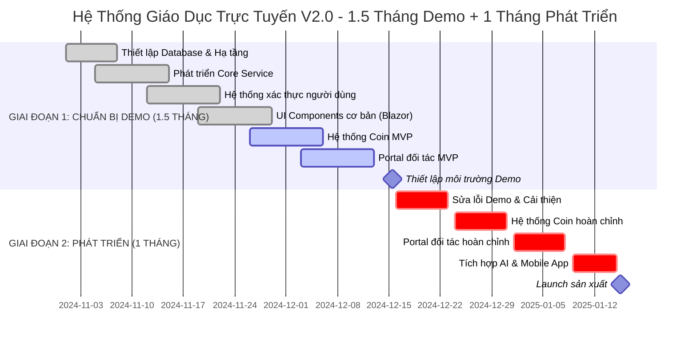

# 📅 TIMELINE 2.5 THÁNG HOÀN THIỆN & 1.5 THÁNG DEMO
## HỆ THỐNG GIÁO DỤC TRỰC TUYẾN V2.0 (B2B2C)

---

## 🎯 **TỔNG QUAN TIMELINE**

```
🏫 HỆ THỐNG GIÁO DỤC TRỰC TUYẾN V2.0 (B2B2C)
┌─────────────────────────────────────────────────────────────────────────────┐
│                   1.5 THÁNG DEMO (6 TUẦN LÀM VIỆC)                        │
│                   1 THÁNG PHÁT TRIỂN (4 TUẦN LÀM VIỆC)                    │
│                                                                             │
│  📅 2024-11-01 → 2024-12-15    2024-12-16 → 2025-01-15                   │
│  (Trừ T7, CN)                    (Trừ T7, CN)                              │
│                                                                             │
│  🎯 SẴN SÀNG DEMO               ✅ SẴN SÀNG SẢN XUẤT                       │
│  Tính năng cốt lõi               Sửa lỗi & Tính năng nâng cao              │
│  Hệ thống Coin cơ bản           Hệ thống đối tác hoàn chỉnh                │
│  Portal đối tác MVP             Tích hợp & Tối ưu hiệu suất               │
│  Chấm điểm AI cơ bản            Mobile App & Bảo mật                       │
│                                                                             │
│  📊 CỘT MỐC:                     📊 CỘT MỐC:                               │
│  ✅ Môi trường Demo              ✅ Tất cả tính năng hoàn thành             │
│  ✅ API cốt lõi hoạt động         ✅ Hiệu suất tối ưu                       │
│  ✅ UI cơ bản sẵn sàng            ✅ Bảo mật đã kiểm tra                    │
│  ✅ Hệ thống Coin MVP             ✅ Triển khai sản xuất                    │
│  ✅ Portal đối tác MVP            ✅ Marketing sẵn sàng                     │
└─────────────────────────────────────────────────────────────────────────────┘
```

---

## 📊 **GANTT CHART - TIMELINE CHI TIẾT**



---

## 📋 **CHI TIẾT KẾ HOẠCH PHÁT TRIỂN**

### 🚀 **GIAI ĐOẠN 1: CHUẨN BỊ DEMO (1.5 THÁNG - 6 TUẦN LÀM VIỆC)**

#### **📅 Tuần 1 (01/11 - 08/11): Hạ tầng & Database**
**🎯 Mục tiêu Sprint:** Thiết lập hạ tầng cơ sở và database

**Sản phẩm hoàn thành:**
- ✅ Schema database PostgreSQL (Users, Partners, Coins, Commissions)
- ✅ Collections MongoDB (Courses, Exams, Progress)
- ✅ Cấu hình cache Redis
- ✅ Thiết lập Docker containers
- ✅ Repository Git và pipeline CI/CD

**Nhiệm vụ:**
- Thiết kế database và migration scripts
- Docker compose cho phát triển local
- Kubernetes manifests cơ bản
- Thiết lập GitHub Actions CI/CD
- Công cụ chất lượng code (SonarQube)

**Nguồn lực:** Phong (Kiến trúc sư), Kiên (Backend), Kỹ sư DevOps

---

#### **📅 Tuần 2 (11/11 - 15/11): Core Services & Xác thực**
**🎯 Mục tiêu Sprint:** Phát triển Core Service và hệ thống xác thực

**Sản phẩm hoàn thành:**
- ✅ Core Service (.NET 8) với quản lý người dùng
- ✅ Triển khai JWT token
- ✅ Phân quyền theo vai trò (Student, Teacher, Admin, Partner, Accountant)
- ✅ API CRUD cơ bản cho users
- ✅ Tài liệu Swagger

**Nhiệm vụ:**
- API đăng ký/đăng nhập/đăng xuất người dùng
- Phân quyền theo vai trò
- Mã hóa mật khẩu và bảo mật
- Phiên bản API
- Ghi log request/response

**Nguồn lực:** Kiên (Backend), Phong (Bảo mật)

---

#### **📅 Tuần 3 (18/11 - 22/11): UI cơ bản & Điều hướng**
**🎯 Mục tiêu Sprint:** Phát triển UI cơ bản và điều hướng

**Sản phẩm hoàn thành:**
- ✅ Layout cơ bản Blazor Server
- ✅ UI đăng ký/đăng nhập người dùng
- ✅ Điều hướng và routing cơ bản
- ✅ Nền tảng thiết kế responsive
- ✅ Kiểm thử tích hợp API

**Nhiệm vụ:**
- Thiết lập components UI MudBlazor
- Form cơ bản với validation
- Menu điều hướng và layout
- Thiết kế responsive mobile
- Kiểm thử tích hợp với backend APIs

**Nguồn lực:** Cường (Frontend), Kiên (Tích hợp API)

---

#### **📅 Tuần 4 (25/11 - 29/11): Hệ thống Coin MVP**
**🎯 Mục tiêu Sprint:** Triển khai hệ thống coin cơ bản

**Sản phẩm hoàn thành:**
- ✅ API mua coin
- ✅ Tích hợp cổng thanh toán (VNPay, MoMo)
- ✅ Quản lý số dư coin
- ✅ Lịch sử giao dịch cơ bản
- ✅ Xác thực và bảo mật coin

**Nhiệm vụ:**
- Xử lý giao dịch coin
- Callback cổng thanh toán
- Tính toán số dư coin
- Ghi log giao dịch
- Phát hiện gian lận cơ bản

**Nguồn lực:** Kiên (Backend), Kế toán (Logic nghiệp vụ)

---

#### **📅 Tuần 5 (02/12 - 06/12): Partner Portal MVP**
**🎯 Sprint Goal:** Phát triển Partner Portal cơ bản

**Deliverables:**
- ✅ Partner registration APIs
- ✅ Basic Partner Portal UI
- ✅ Referral code generation
- ✅ Partner authentication
- ✅ Basic commission calculation

**Tasks:**
- Partner onboarding process
- Referral code validation
- Partner dashboard foundation
- Commission calculation logic
- Partner role permissions

**Resources:** Kiên (Backend), Cường (Partner Portal UI)

---

#### **📅 Tuần 6 (09/12 - 13/12): Content Service & Integration**
**🎯 Sprint Goal:** Phát triển Content Service và tích hợp

**Deliverables:**
- ✅ Content Service APIs
- ✅ Course management UI
- ✅ Basic exam system
- ✅ Course enrollment system
- ✅ Progress tracking

**Tasks:**
- Course CRUD operations
- Exam creation và submission
- Learning progress tracking
- Content management UI
- API integration testing

**Resources:** Kiên (Backend), Cường (Content UI)

---

#### **📅 Tuần 7 (16/12 - 20/12): Demo Environment & Testing**
**🎯 Sprint Goal:** Chuẩn bị demo environment

**Deliverables:**
- ✅ Demo environment setup
- ✅ Demo scenarios và scripts
- ✅ Basic testing completed
- ✅ Demo data preparation
- ✅ Demo presentation ready

**Tasks:**
- Demo environment configuration
- Demo scenarios preparation
- Basic testing và bug fixes
- Demo data seeding
- Presentation preparation

**Resources:** Toàn bộ team

---

### 🏗️ **GIAI ĐOẠN 2: PHÁT TRIỂN (1 THÁNG - 4 TUẦN LÀM VIỆC)**

#### **📅 Tuần 5 (02/12 - 06/12): Portal đối tác MVP**
**🎯 Mục tiêu Sprint:** Phát triển Portal đối tác cơ bản

**Sản phẩm hoàn thành:**
- ✅ Partner registration APIs
- ✅ Basic Partner Portal UI
- ✅ Partner dashboard cơ bản
- ✅ Commission tracking cơ bản
- ✅ Partner management tools

**Nhiệm vụ:**
- Partner registration system
- Basic Partner Portal UI
- Commission tracking
- Partner management
- Basic analytics

**Nguồn lực:** Kiên (Backend), Cường (Frontend)

---

#### **📅 Tuần 6 (09/12 - 13/12): Content Service & Integration**
**🎯 Mục tiêu Sprint:** Phát triển Content Service và tích hợp

**Sản phẩm hoàn thành:**
- ✅ Content Service APIs
- ✅ Course management UI
- ✅ Exam system cơ bản
- ✅ Progress tracking
- ✅ Content integration

**Nhiệm vụ:**
- Content Service development
- Course management system
- Exam system implementation
- Progress tracking
- Content integration

**Nguồn lực:** Kiên (Backend), Cường (Frontend)

---

#### **📅 Tuần 7 (16/12 - 20/12): Demo Environment & Testing**
**🎯 Mục tiêu Sprint:** Chuẩn bị demo environment

**Sản phẩm hoàn thành:**
- ✅ Demo environment setup
- ✅ Demo scenarios và scripts
- ✅ Testing và bug fixes
- ✅ Performance optimization
- ✅ Security checks

**Nhiệm vụ:**
- Demo environment setup
- Demo scenario preparation
- Testing and bug fixes
- Performance optimization
- Security validation

**Nguồn lực:** Toàn bộ team

---

#### **📅 Tuần 8 (23/12 - 27/12): Sửa lỗi Demo & Cải thiện**
**🎯 Mục tiêu Sprint:** Sửa lỗi từ demo và cải thiện hệ thống

**Sản phẩm hoàn thành:**
- ✅ Sửa lỗi phát hiện trong demo
- ✅ Cải thiện hiệu suất hệ thống
- ✅ Tối ưu hóa UI/UX
- ✅ Hoàn thiện tính năng cơ bản
- ✅ Chuẩn bị cho giai đoạn phát triển

**Nhiệm vụ:**
- Phân tích phản hồi từ demo
- Sửa lỗi bugs và issues
- Cải thiện trải nghiệm người dùng
- Tối ưu hóa hiệu suất
- Chuẩn bị roadmap phát triển

**Nguồn lực:** Toàn bộ team

---

#### **📅 Tuần 9 (30/12 - 03/01): Hệ thống Coin hoàn chỉnh**
**🎯 Mục tiêu Sprint:** Hoàn thiện hệ thống Coin

**Sản phẩm hoàn thành:**
- ✅ Hệ thống Coin nâng cao
- ✅ Referral code system hoàn chỉnh
- ✅ Commission calculation tự động
- ✅ Coin analytics và reporting
- ✅ Coin security enhancements

**Nhiệm vụ:**
- Advanced coin features
- Referral code management
- Commission automation
- Analytics implementation
- Security hardening

**Nguồn lực:** Kiên (Backend), Phong (Architecture)

---

#### **📅 Tuần 10 (06/01 - 10/01): Portal đối tác hoàn chỉnh**
**🎯 Mục tiêu Sprint:** Hoàn thiện Portal đối tác

**Sản phẩm hoàn thành:**
- ✅ Portal đối tác hoàn chỉnh
- ✅ Dashboard analytics chi tiết
- ✅ Công cụ quản lý đối tác
- ✅ Báo cáo commission
- ✅ Công cụ giao tiếp đối tác

**Nhiệm vụ:**
- Advanced Partner Portal features
- Analytics dashboard
- Management tools
- Reporting system
- Communication features

**Nguồn lực:** Cường (Frontend), Kiên (Backend)

---

#### **📅 Tuần 11 (13/01 - 17/01): Tích hợp AI & Mobile App**
**🎯 Mục tiêu Sprint:** Tích hợp AI và phát triển Mobile App

**Sản phẩm hoàn thành:**
- ✅ Tích hợp AI grading system
- ✅ Flutter mobile app
- ✅ Auto-grading cho bài thi
- ✅ Mobile-specific features
- ✅ Push notifications

**Nhiệm vụ:**
- AI service integration
- Flutter development
- Auto-grading implementation
- Mobile UI/UX
- Push notification setup

**Nguồn lực:** Kiên (AI Integration), Mobile Developer (Flutter)

---

## 🏆 **CỘT MỐC & SẢN PHẨM HOÀN THÀNH**

### **🎯 Kết thúc Giai đoạn 1 (1.5 tháng): Sẵn sàng Demo**
```
✅ Database & Hạ tầng sẵn sàng
✅ API Core Services hoàn thành
✅ Xác thực cơ bản hoạt động
✅ Nền tảng UI Components
✅ Hệ thống Coin MVP hoạt động
✅ Portal đối tác MVP sẵn sàng
✅ Content Service cơ bản
✅ Môi trường Demo ổn định
```

### **🏆 Kết thúc Giai đoạn 2 (1 tháng): Sẵn sàng Sản xuất**
```
✅ Tất cả tính năng hoàn thành & Kiểm thử
✅ Hiệu suất tối ưu
✅ Bảo mật đã kiểm tra
✅ Mobile App sẵn sàng
✅ Tích hợp AI hoàn thành
✅ Triển khai sản xuất
✅ Tài liệu Marketing sẵn sàng
✅ Chuẩn bị Launch hoàn thành
```

---

## 👥 **PHÂN BỔ NGUỒN LỰC**

### **Thành phần Team:**
- **Product Owner**: Nguyên (Toàn thời gian)
- **Kiến trúc sư hệ thống**: Phong (Toàn thời gian)
- **Lập trình viên Backend**: Kiên (Toàn thời gian)
- **Lập trình viên Frontend**: Cường (Toàn thời gian)
- **Lập trình viên Mobile**: Bên ngoài (Bán thời gian Tuần 11-14)
- **Kỹ sư QA**: Bên ngoài (Bán thời gian Tuần 13-14)
- **Kỹ sư DevOps**: Bên ngoài (Bán thời gian)

### **Phân bổ Ngân sách:**
```
💰 Ngân sách Phát triển: 400M VNĐ
├── Lương: 240M VNĐ (60%)
├── Hạ tầng: 80M VNĐ (20%)
├── Công cụ & Giấy phép: 40M VNĐ (10%)
├── Kiểm thử & Bảo mật: 40M VNĐ (10%)
└── Marketing & Launch: 40M VNĐ (10%)
```

---

## ⚠️ **RỦI RO & GIẢI PHÁP**

### **Rủi ro Cao:**
- **Độ phức tạp tích hợp AI**: Giải pháp - Bắt đầu sớm, có backup chấm điểm thủ công
- **Tích hợp cổng thanh toán**: Giải pháp - Kiểm thử với môi trường sandbox trước
- **Phát triển Mobile App**: Giải pháp - Sử dụng Flutter để phát triển nhanh hơn

### **Rủi ro Trung bình:**
- **Quy trình Onboarding đối tác**: Giải pháp - Tạo tài liệu hướng dẫn rõ ràng
- **Vấn đề hiệu suất**: Giải pháp - Triển khai monitoring từ ngày đầu
- **Lỗ hổng bảo mật**: Giải pháp - Kiểm tra bảo mật định kỳ

### **Rủi ro Thấp:**
- **Thiết kế UI/UX**: Giải pháp - Sử dụng hệ thống thiết kế đã có
- **Tương thích đa trình duyệt**: Giải pháp - Kiểm thử sớm và thường xuyên
- **Tài liệu**: Giải pháp - Viết tài liệu trong quá trình phát triển

---

## 📊 **CHỈ SỐ THÀNH CÔNG**

### **Chỉ số Giai đoạn Demo (1.5 tháng):**
- **API cốt lõi**: 100% hoạt động
- **UI Components**: 80% hoàn thành
- **Hệ thống Coin**: Chức năng cơ bản hoạt động
- **Portal đối tác**: MVP sẵn sàng
- **Kịch bản Demo**: 5+ kịch bản sẵn sàng

### **Chỉ số Giai đoạn Sản xuất (1 tháng):**
- **Thời gian phản hồi API**: < 300ms (95% percentile)
- **Thời gian hoạt động hệ thống**: > 99.5%
- **Người dùng đồng thời**: Hỗ trợ 5,000+ người dùng
- **Hiệu suất Mobile App**: < 2s thời gian tải
- **Điểm bảo mật**: Cấp A

---

## 🎯 **KỊCH BẢN DEMO (1.5 THÁNG)**

### **Kịch bản 1: Học viên mới đăng ký và nạp coin**
1. Đăng ký tài khoản học viên
2. Xác thực email
3. Nạp coin với mã giới thiệu
4. Mua bài thi bằng coin
5. Làm bài thi và nhận kết quả

### **Kịch bản 2: Trung tâm đối tác đăng ký và tạo mã**
1. Đăng ký trung tâm đối tác
2. Admin phê duyệt
3. Tạo mã giới thiệu
4. Theo dõi học viên được giới thiệu
5. Xem dashboard hoa hồng

### **Kịch bản 3: Admin quản lý hệ thống**
1. Đăng nhập admin portal
2. Quản lý người dùng
3. Quản lý khóa học và bài thi
4. Quản lý đối tác
5. Xem báo cáo tổng quan

### **Kịch bản 4: Giáo viên chấm bài thi**
1. Đăng ký giáo viên
2. Nhận bài thi cần chấm
3. Sử dụng AI hỗ trợ chấm điểm
4. Viết feedback
5. Submit kết quả

---

## 📋 **DANH SÁCH KIỂM TRA GO-LIVE**

### **Ngày Demo (1.5 tháng):**
- [ ] Môi trường Demo ổn định
- [ ] Tất cả kịch bản demo hoạt động
- [ ] Tài liệu thuyết trình sẵn sàng
- [ ] Thu thập phản hồi stakeholder
- [ ] Lập kế hoạch giai đoạn tiếp theo hoàn thành

### **Launch Sản xuất (1 tháng):**
- [ ] Thiết lập môi trường sản xuất
- [ ] Kiểm thử script migration database
- [ ] Cài đặt chứng chỉ SSL
- [ ] Cấu hình CDN hoàn thành
- [ ] Cấu hình công cụ monitoring
- [ ] Triển khai zero-downtime
- [ ] Khởi động chiến dịch marketing
- [ ] Team hỗ trợ sẵn sàng

---

## 🚀 **CÁC BƯỚC TIẾP THEO**

1. **Ngay lập tức (Tuần 1):**
   - Thiết lập môi trường phát triển
   - Tạo repositories dự án
   - Cấu hình pipeline CI/CD
   - Bắt đầu thiết kế database

2. **Ngắn hạn (Tuần 2-4):**
   - Phát triển core services
   - Xây dựng UI components cơ bản
   - Triển khai xác thực
   - Bắt đầu phát triển hệ thống coin

3. **Trung hạn (Tuần 5-8):**
   - Hoàn thành hệ thống coin
   - Xây dựng portal đối tác
   - Tích hợp cổng thanh toán
   - Chuẩn bị môi trường demo

4. **Dài hạn (Tuần 9-14):**
   - Tính năng nâng cao
   - Tối ưu hiệu suất
   - Kiểm tra bảo mật
   - Triển khai sản xuất

---

## 📞 **KẾ HOẠCH GIAO TIẾP**

### **Daily Standups:**
- **Thời gian**: 9:00 sáng hàng ngày
- **Thời lượng**: 15 phút
- **Định dạng**: Hôm qua bạn đã làm gì? Hôm nay bạn sẽ làm gì? Có gặp vấn đề gì không?

### **Đánh giá Hàng tuần:**
- **Thời gian**: Thứ 6 2:00 chiều
- **Thời lượng**: 1 giờ
- **Định dạng**: Demo tiến độ, thảo luận vấn đề, lập kế hoạch tuần tới

### **Thuyết trình Demo:**
- **Thời gian**: Kết thúc Giai đoạn 1 (1.5 tháng)
- **Thời lượng**: 2 giờ
- **Định dạng**: Demo trực tiếp, Hỏi đáp, thu thập phản hồi

---

## 🎉 **KẾT LUẬN**

Timeline này được thiết kế để hoàn thành hệ thống giáo dục trực tuyến V2.0 trong **2.5 tháng** với **1.5 tháng demo** và **1 tháng phát triển**. Với team 4 người core và nguồn lực bên ngoài, chúng ta có thể đạt được mục tiêu này với chất lượng cao và đảm bảo tất cả tính năng B2B2C hoạt động tốt.

**Yếu tố Thành công Chính:**
1. **Phát triển Song song**: Phát triển song song các components
2. **Phương pháp MVP**: Tập trung vào tính năng cốt lõi trước
3. **Kiểm thử Liên tục**: Test liên tục trong quá trình phát triển
4. **Phản hồi Stakeholder**: Thu thập phản hồi sớm và thường xuyên
5. **Quản lý Rủi ro**: Xử lý rủi ro sớm và có kế hoạch dự phòng

**Timeline này thực tế và khả thi** với team hiện tại và có thể điều chỉnh linh hoạt theo tình hình thực tế! 🚀
